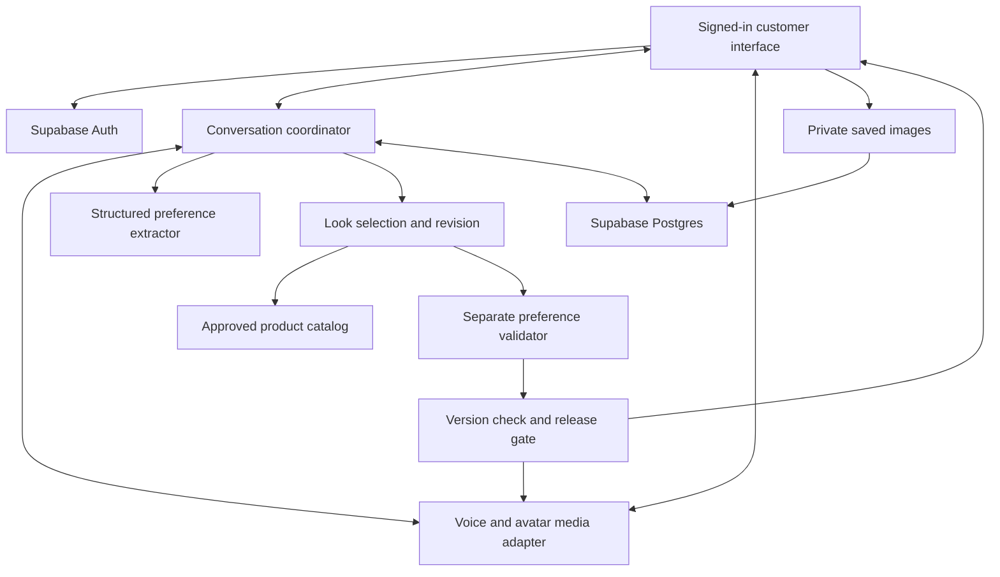

# AI Stylist: Technical decisions, system patterns and architecture

Status: Draft for Sabine's review, v0.11  
Created: 9 October 2026  
Approval: Phone website delivery, email/password plus Google and Apple sign-in, one simultaneous consultation for first launch, and Supabase for accounts, saved preferences, wardrobe photos and saved looks approved by Sabine on 9 October 2026; ElevenLabs excluded by Sabine on 9 October 2026; initial $25 experiment spending limit approved by Sabine on 9 October 2026; Supabase + Render approved for MVP hosting by Sabine on 9 October 2026; React + TypeScript website and Node.js + TypeScript service approved on 9 October 2026; volatile unsaved notes accepted for the private prototype only; remaining architecture and operational choices are pending  
Baselines: [Product specification v1.0](product-spec.md), approved 8 October 2026; [Design specification v1.0](design.md), approved 9 October 2026  
Evidence: Official provider and testing documentation reviewed on 9 October 2026  
Canonical file: tech-spec.md  
Build plan and current status: [docs/progress.md](../docs/progress.md)

## 1. Summary in plain words

The app needs five parts: the customer interface, a realistic speaking stylist, live notebook memory, a service that finds real products, and a separate service that checks each proposed look. Sabine approved Supabase for accounts, saved preferences, wardrobe photos and saved looks on 9 October 2026. Use Supabase Auth for account access, Postgres for saved records and private Storage for saved images. Optional Edge Function uses and remaining deployment details are still proposed. Sabine approved Supabase + Render for the MVP on 9 October 2026: Render hosts the customer website and conversation service. A static website and a separate small web service remain the proposed deployment arrangement; React + TypeScript and Node.js + TypeScript are now approved separately in D12; instance sizes, regions, deployment arrangement and account settings still need review.

Sabine approved starting with a website designed for phones on 9 October 2026. Customers will open it in their phone browser. Sabine subsequently approved React + TypeScript for the website and Node.js + TypeScript for the conversation service on 9 October 2026, recorded in D12. Hosting approval is recorded in D11. An App Store or Google Play app would require a later separate decision. The approved notebook appearance, collage, navigation, and accessibility requirements apply to either approach.

The hardest dependency is connecting OpenAI's voice conversation to Tavus's photorealistic avatar while preserving interruptions, lip synchronization, live notes, and preference checking. That connection must be demonstrated before choosing the final media architecture. Real US product data and approved affiliate access are a second launch dependency.

This document proposes how to meet the agreed requirements and records limited prototype evidence below. It does not approve unresolved architecture choices or close launch risks. Phone website delivery, email/password plus Google and Apple sign-in, a first launch with one simultaneous consultation, and Supabase for accounts, saved preferences, wardrobe photos and saved looks are approved. Supabase + Render is also approved for MVP hosting. Other technologies, limits, retention periods, and implementation details below remain proposals until reviewed with Sabine.

Sabine confirmed one simultaneous consultation for first launch. Keep provider, catalog and state adapters extensible so capacity can increase later without changing notebook or validation rules. Sabine approved the $25 total initial-experiment limit on 9 October 2026. Task 1a has prepared its dated cost worksheet, with a separate expanded option requiring later approval. See the discovery plan below.

### Critical risks to prove early

- **Voice/avatar compatibility and live notes:** the proposed connection must work with interruptions and notes during continuous speech, not just a recorded demo.
- **Preference checking before presentation:** stale or conflicting looks must not be displayed or recommended aloud.
- **Customer privacy and isolation:** private images, account access and external-provider retention need verified controls.
- **Real shopping sources:** data access, image rights, required product evidence and affiliate approval are launch dependencies.
- **Cost:** the initial $25 experiment cap is approved; actual account charges and production unit costs remain unverified. Sabine reports existing Supabase Pro. Check incremental project costs before billed work.

See risks R01–R11 in Section 15 and their blocking checkpoints in docs/progress.md. These risks remain open; written mitigations are not completed validation.

## 2. What is fixed and what needs approval

**Approved provider constraint, 9 October 2026:** Do not use ElevenLabs for this project. Exclude its voice generation, agent services, project SDK/API dependencies, credentials and configured fallbacks, including a voice-provider selection inside Tavus. OpenAI Realtime and Tavus remain candidates, subject to a compatible prototype; their integration is not newly approved by this exclusion.


### Approved requirements carried forward

- Both women and men, USA first, USD, account required before styling. Sabine also approved email/password with recovery, Google sign-in and Apple sign-in for the first version on 9 October 2026.
- One consistent photorealistic female stylist; natural conversation with captions and touch/text alternatives.
- Preferences collected during the first conversation, with separate explicit profile saving.
- Progressive notebook updates during continuous speech, corrections, visible uncertainty, and actual item photos.
- Live camera, customer-confirmed still references, and optional digital wardrobe saving in the first version.
- One look at a time, repeated feedback, kept items, comparison, and undo.
- A separate background preference check before each recommendation, revision, restore, and shopping list addition.
- Real retailer product pages, source-backed estimates, external checkout, affiliate commission revenue and disclosures.
- Saved looks contain the look only. Notebook notes, feedback, conversation, and session revision history stay within the session.
- Supabase as the platform foundation; approved design v1.0, including the notebook starting collapsed.

### Technical decision log

| ID | Status/date | Decision and reason | Owner and verification |
| --- | --- | --- | --- |
| D01 | Platform approved 8 October 2026; core roles approved 9 October 2026 | Supabase handles accounts, saved preferences, wardrobe photos and saved looks. Auth, Postgres and private Storage support these roles on the chosen platform. Optional Edge Function uses and operational settings remain proposed; MVP hosting is approved separately in D11. | Sabine; implementation and isolation evidence in Phase 2. |
| D02 | Approved, 9 October 2026 | First delivery is a website designed for phones, accessible in a browser. Native app distribution is a later decision. | Sabine; physical-phone checks in Phases 1 and 8. |
| D03 | Approved, 9 October 2026 | Email/password with recovery, Google sign-in and Apple sign-in in the first version. | Sabine; P2-01/P2-04/P2-06 and real-provider manual checks. |
| D04 | Approved capacity target, 9 October 2026 | One simultaneous consultation for first launch. Infrastructure should have seams to increase capacity later. | Sabine; atomic-slot test in Phase 2 and load checks in Phase 8. |
| D05 | Approved product constraint, 8 October 2026 | Save look stores the look, not notebook notes, feedback, transcripts or revision history. Profile/wardrobe saves are separate. | Sabine; P7-01/P7-02/P7-04. |
| D06 | Approved design constraint, 9 October 2026 | Notebook starts collapsed; actual item thumbnail and progressive summary remain visible. | Sabine; notebook/component and manual phone checks. |
| D07 | Requirement to propose, 9 October 2026; not architecture approval | Technical memory must record decisions/patterns, propose an extensible secure architecture and flag critical risks. progress.md must track phases with automated and manual checks. | Sabine's task instruction; documents created, implementation remains pending. |
| D08 | Initial cap approved, 9 October 2026 | Sabine approved $25 total for the first private experiment: up to $10 OpenAI, $7 hosting and $8 reserve, with available free Tavus minutes. This is not approval of the $100 expanded illustration, a production budget or unreviewed technology choices. | Approved in direct reply to the spending-limit question; worksheet and stopping controls in docs/task-1a-discovery-plan.md. |
| D09 | Approved exclusion, 9 October 2026 | ElevenLabs is excluded from the project, including voice, agents, API/SDK integration and configured provider fallbacks. Check the selected Tavus voice path before accepting it. | Sabine; provider-policy fixture and actual configuration review in 1b/8a. |
| D10 | Task scope authorized, 9 October 2026 | Sabine instructed the team to proceed with 1a. Prepare research, recommendations and reviewable documents. This does not approve the proposed technologies, a dollar cap, paid setup or group 1b. | Implementer prepares; Sabine reviews remaining decisions. |
| D11 | MVP hosting approved, 9 October 2026 | Supabase + Render for the MVP. Supabase keeps accounts, saved preferences, wardrobe photos and saved looks; Render hosts the website and conversation service. This uses two hosting platforms while retaining Supabase account/data tools. The earlier Cloudflare Pages proposal is superseded. | Sabine explicitly selected this setup. Runtime/framework subsequently approved in D12; service sizing, production budget, security configuration and deployment evidence remain pending. |
| D12 | Tools approved, 9 October 2026 | React + TypeScript for the website and Node.js + TypeScript for the conversation service. React supports interactive notebook/look screens; shared TypeScript contracts help catch data-shape mistakes across client and server. | Sabine replied "1a and 2a" to the numbered approval choices. Specific versions, libraries and deployment configuration remain to be selected and checked in the relevant build groups. |
| D13 | Private prototype tradeoff approved, 9 October 2026 | Keep unsaved session notes in volatile memory for the private prototype only. A coordinator restart loses active notes, feedback and unsaved reference images; saved Supabase records remain. A brief disconnect can resume only while the same owned server session still exists. | Sabine selected 2a. Explain restart loss, stop stale visual/audio recommendations and offer a new consultation from saved data. Verify behavior in the prototype. Customer MVP recovery requires a separate review before launch; no persistent recovery store is approved. |
| D14 | Task 1b authorized, 9 October 2026 | Sabine said "proceed with 1b." Build the isolated voice/avatar experiment and its checks under the existing provider exclusion, privacy preflight and $25 cap. | Local simulation and a scripted provider probe are implemented; continuous conversation and physical-phone acceptance remain pending. This does not approve Task 1c, a different media architecture or expanded spending. |

Sabine reported an existing Supabase Pro plan on 9 October 2026. Account organization, allocated compute credit and actual incremental charges are unverified; see the cost worksheet.

For proposed technologies T01–T09, record accepted/rejected choices here after review, with rationale and evidence. A framework, host, provider connection or retention setting described below is not an approved decision simply because it appears in the architecture diagram.

### Decision status and proposed choices to review

| ID | Proposal | Reason or unresolved dependency |
| --- | --- | --- |
| T01 | Phone website first: approved by Sabine on 9 October 2026. React + TypeScript: approved on 9 October 2026. | Phone delivery and the later Supabase + Render host selection are approved; React + TypeScript is approved separately in D12. Actual phone media behavior needs a prototype. Native distribution is outside the initial delivery plan. |
| T02 | Approved: Supabase for accounts, saved preferences, wardrobe photos and saved looks, using Auth, Postgres and private Storage. | Approved by Sabine on 9 October 2026. Schema, security configuration, optional Edge Functions and other data-service uses remain implementation proposals to review. |
| T03 | Approved: Supabase + Render for MVP hosting. Render hosts the website and conversation service; Supabase retains its approved account/data/image roles. | Sabine approved on 9 October 2026. Propose a Render static site plus a small web service. Node.js + TypeScript is approved in D12; instance sizes, regions, authentication deployment and account configuration remain implementation proposals. Cloudflare Pages is superseded. |
| T04 | Prototype OpenAI Realtime with Tavus external playback first; ElevenLabs excluded. | Preserve the intended candidates; streaming audio, synchronization, interruption and live transcription support remain unproven. Check selected voice providers and fallbacks against D09. |
| T05 | Email/password with recovery, Google sign-in and Apple sign-in: approved by Sabine on 9 October 2026. | Supabase Auth is approved for account access; callback/session implementation and email-verification settings remain proposed. Provider setup, callback security and account identity handling need implementation review and tests. |
| T06 | Approved for the private prototype only: volatile session memory, with explicit expiry | Sabine accepted restart loss on 9 October 2026 (D13). Saved Supabase records remain. Before customer launch, review restart recovery and any expiring shared storage/privacy implications; exact timeouts remain proposed. |
| T07 | Hard constraint rules plus a separate AI compatibility evaluator | Numeric and categorical rules are reproducible; subjective style interpretation still needs careful evaluation and uncertainty handling. |
| T08 | Licensed retailer/affiliate feeds or approved APIs | Real sources and imagery rights are required. Specific programs and coverage are not yet agreed or available. |
| T09 | Retention, attempt limits, cost caps and operational targets in this draft | Proposed settings must be agreed and measured. The product's existing latency requirements remain fixed. |
| T10 | One simultaneous consultation for first launch: approved by Sabine on 9 October 2026. | Enforce a single consultation slot initially; later capacity increases need measured costs and a reviewed session-state design. |

### Task 1a review completed; prototype evidence remains pending

The [Task 1a discovery plan and cost worksheet](../docs/task-1a-discovery-plan.md), dated 9 October 2026, provides the concrete review proposal. It records source-backed prices, assumptions, account actions, data boundaries and privacy preflight requirements. Authorizing 1a started this planning work; the separate budget and MVP hosting approvals are recorded below. Framework/runtime and the private-prototype memory tradeoff are now approved. Other implementation proposals remain pending in their designated groups.

| Decision | Recommendation ready for Sabine | Current status |
| --- | --- | --- |
| T01 | React + TypeScript for the approved phone website | Approved on 9 October 2026 in D12; versions and build dependencies remain to be pinned. |
| T03 | Supabase + Render; propose a Render static site and small Node.js coordinator | Hosting providers and roles approved on 9 October 2026. Node.js + TypeScript runtime approved in D12; service sizing, regions and actual account pricing/capacity remain unverified. |
| T02 optional uses | Defer Edge Functions initially; use coordinator for session/token handling and assess bounded independent jobs later | Proposed deferral, not an added Supabase responsibility. |
| T04 | Try OpenAI Realtime audio through Tavus Echo with one licensed stock female face | Experiment candidate only; compatibility and provider-policy evidence required in 1b. |
| T06 | Volatile session memory for the experiment, with clear loss of unsaved notes on restart | Accepted on 9 October 2026 for the private prototype only (D13). Customer MVP recovery remains unresolved and must be reviewed before launch. |
| T07 | Deterministic hard constraints, independent model check and one version-bound visual/audio release gate | Recommended experiment direction, not proof of effectiveness. |
| D08 / T09 | $25 total initial allowance: $10 OpenAI, $7 hosting, $8 reserve; free avatar/static allowances and existing Supabase Pro only where eligible, with incremental costs checked; maximum 20 connected avatar minutes including setup/retries | Initial dollar cap approved by Sabine on 9 October 2026. Technology choices and other operational settings remain pending. Separate expanded-trial illustration requires separate approval. |
| T05, T08 and production T09 settings | Review detailed authentication configuration, specific catalog programs, retention periods, final model IDs and launch operating budget in their designated groups | Explicitly deferred proposals; existing product requirements remain fixed. |

Provider documentation review found that Tavus Echo does not include the normal perception/speech-recognition layers, so external transcription and camera processing must be proved. Stored transcripts and recording controls require account-specific confirmation; turning off recordings alone is insufficient. OpenAI's Realtime endpoint lists no application-state retention, but default abuse monitoring can retain content for up to 30 days, subject to exceptions. These findings keep R01/R02/R07/R11 open. Actual account settings have not been inspected. [Tavus pipeline modes](https://docs.tavus.io/sections/conversational-video-interface/quickstart/pipeline-modes), [Tavus pricing/transcript features](https://www.tavus.io/pricing), [OpenAI data controls](https://developers.openai.com/api/docs/guides/your-data).

Use synthetic media until the preflight record identifies the selected providers, remaining retention, recording/tracing configuration and consent explanation. Sabine's microphone/camera use is real-person media and needs this preflight too. No paid account setup or prototype code was created in 1a.

### Task 1b implementation findings, 9 October 2026

The isolated harness has a silent simulation and an explicit scripted provider mode. In the repeat, OpenAI Realtime gpt-realtime-2.1 / marin generated a fixed clip, then closed its WebSocket. Buffered PCM16 at 24 kHz was paced to Tavus Audio Echo using pipecat0 and Anna - Casual. Sabine confirmed hearing the sentence and seeing mouth movement. This supports the desktop scripted connection only; continuous streaming, natural latency, precise lip-sync and phone quality remain unverified. [Detailed evidence](../docs/task-1b-voice-avatar.md).

Implementation patterns: separate generation completion from playback acknowledgment; mark only the last Echo chunk done; keep JSON below Daily's 4 KB limit; pace 20 ms chunks and invalidate timers on cancellation. Trust only the expected remote participant and conversation for observed events. Provider speaking duration and sent bytes are not exact customer-heard position. The simulation holds unknown playback position and requires a fresh context; continuous-conversation reset/truncation still needs a working check.

The server owns credentials, fixed-script generation, private-room creation and cleanup. Browser microphone/camera remain disabled. Each attempt reserves $2 and five avatar minutes in an ignored owner-only durable ledger; unresolved creation/cleanup, missing/corrupt records and exhausted allowance block further attempts. Two closed reservations total $4 and ten minutes, not actual billed usage. Private rooms disable recording and expire at 90 seconds, with an earlier server deadline and heartbeat cleanup. End success can have an empty body: verify room status separately before closing its reservation. A first-run false cleanup hold exposed and corrected that parsing assumption.

68 focused mocked tests, type checking and build pass. No switch to the full Tavus pipeline, text Echo, GPT-Live or ElevenLabs is approved. The inspected Echo PAL has no TTS/LLM/STT layer and microphone disabled; no PAL was changed. Actual provider retention/training/deletion, human-media consent, exact playback evidence, real-phone behavior and actual cost reconciliation remain open. R01/R07/R09/R10/R11 remain open. Exact dependencies are experiment choices in the lockfile, not production architecture approval.

## 3. Proposed architecture and hosting



The diagram shows logical responsibilities, not a proven media connection. The release gate controls both the visible recommendation and the stylist's description of recommended products. The media adapter is selected only after the integration prototype.

| Service | Proposed responsibility | Important boundary |
| --- | --- | --- |
| Customer interface on Render | Account screens, avatar stage, captions, notebook, camera preview, collage, feedback, wardrobe, saved looks, profile and shopping list | Never contains provider secret keys or decides that an unchecked look can be released. |
| Supabase Auth | Account identity and access recovery | Signing in does not grant camera, microphone or permanent-save consent. |
| Supabase Postgres | Explicitly saved profiles, wardrobe entries, saved looks, lists, catalog records and minimal operational records | Do not store notebook notes, transcripts, feedback or session revision history by default. |
| Supabase private Storage | Explicitly saved wardrobe images and selected saved-look visual assets | Owner-scoped access; session-only images remain temporary. |
| Supabase Edge Functions | Bounded account/export/deletion jobs, token issuance or catalog operations where execution fits | Long conversations and repeated model orchestration live outside the function request lifecycle. |
| Conversation coordinator on Render | Authenticated session ownership, ordered edits, transient notes, media events, extraction, candidate generation and validation, cancellation and cleanup | Initially one service instance with bounded concurrent sessions; scale design requires further review. |
| OpenAI adapters | Conversation candidate, continuous transcription where required, structured extraction, garment analysis, selection and independent compatibility evaluation | Model IDs and SDK versions are chosen and pinned after capability, quality, latency and cost checks. |
| Tavus adapter | The approved realistic stylist presentation and tested speech/video path | No assumed plug-and-play Realtime connection. |
| Catalog importer | Normalize approved US products and source facts, track feed health and freshness | No fabricated URLs, unlicensed imagery, or assumed retailer access. |

Supabase documents Edge Function wall time limits of 150 seconds on free plans and 400 seconds on paid plans, with other resource limits. This supports proposing a separate coordinator for sessions that can last much longer, rather than assuming a function request can carry the entire consultation. [Supabase function limits](https://supabase.com/docs/guides/functions/limits)

Supabase + Render is the approved MVP hosting setup. Propose a Render static site for the interface and a separate web service for conversation coordination. Static sites use the workspace bandwidth/build allowances. Render supports WebSockets; interrupted connections may reconnect to another instance. Include keepalives, reconnect handling and graceful shutdown. The single-instance arrangement remains proposed; volatile-state restart loss is accepted only for the private prototype in D13. Customer MVP recovery still needs review. No Render deployment or account configuration has been completed. [Render static sites](https://render.com/docs/static-sites), [Render WebSockets](https://render.com/docs/websocket)

### Architecture boundaries and system patterns

Propose a modular app and coordinator, with clear internal responsibilities and one initial coordinator deployment. Separate logical agent roles do not require one hosted service per role. This keeps the first launch manageable while allowing individual components to be replaced or scaled later.

```text
apps/web                 Customer screens and approved design tokens
apps/coordinator         Authenticated API, live session orchestration and release gate
packages/domain          Typed notes, money, feedback, constraints and pure state rules
packages/contracts       Versioned request/event schemas and shared validation
packages/adapters        Media, models, product sources and persistence implementations
supabase/migrations      Ordered schema and policy changes
supabase/tests           Owner isolation and database behavior tests
tests/fixtures           Synthetic speech events, products, images and expected outcomes
docs/progress.md         Phased tasks, verification and current status
Project Memory/tech-spec.md  Decisions, system patterns and risk register
```

This is a proposed repository structure, not folders already created by this planning work. Keep the domain layer independent of React, Supabase and provider SDKs. Provider-specific event formats are translated at the adapter boundary.

| Pattern | Proposed rule | Extension and verification |
| --- | --- | --- |
| Adapter contracts | Define `MediaAdapter`, `TranscriptionAdapter`, `ModelAdapter`, `CatalogAdapter`, `ProfileRepository`, `AssetRepository` and `SessionStore` interfaces. Inject their implementations. | Replace a model, avatar or retailer source without changing notebook rules. Each adapter passes the same contract fixture tests. |
| Capability declaration | Media/source adapters declare supported partial transcripts, interruption, live frames, currency, variants and source evidence. | Unsupported capability produces a known limitation, never a guessed successful result. Required launch capabilities must be proved or the relevant gate remains open. |
| One mutation authority | All active-session changes use a typed reducer and monotonically increasing revisions. Profile/reference changes invalidate affected approvals through the coordinator. | New clients use the same contract; UI code cannot bypass the validator by constructing its own current look. |
| Pure hard constraints | Money, kept-item IDs, exclusions and required known facts use small deterministic functions; AI evaluates only the semantic questions it can answer. | Add constraint types through a registered typed rule, its tests and approved product meaning. An AI assertion cannot disable a rule. |
| Explicit persistence projections | Each Save action constructs an allowed record shape, separate from the transient session shape. | A new saved feature cannot accidentally serialize a complete notebook. Tests reject extra fields and verify consent boundaries. |
| Versioned contracts | Include schema version, event ID, expected revision and session epoch; reject unsupported versions clearly. | Later mobile clients and adapters can migrate safely rather than interpreting unknown data as valid. |
| Migrations and compatibility | Apply ordered database migrations to a clean test database and a prior supported schema. Prefer additive changes before removals. | Rollback and app-version compatibility are rehearsed using synthetic saved records. Do not drop or reinterpret customer data without a reviewed migration. |
| Bounded work and cancellation | Give every external call a deadline, cancellation signal, attempt cap and idempotency handling. | New providers inherit the same fail-closed and spend-limiting behavior. Avoid uncontrolled agent recursion or tool chains. |
| Catalog normalization | Retain stable source/variant IDs and original evidence independently of ranking/model output. | Add retailers through adapters. Future countries/currencies require a market policy and approval; first-version US/USD rules stay explicit. |
| Redacted observability | Collect durations, outcome codes, resource counts and anonymous aggregate health separately from content. | New diagnostics never automatically log prompts, notes, photos or customer identity. Test redaction using sentinel values. |

Proposed API failures have explicit categories: unauthenticated, forbidden, stale revision, clarification required, invalid input, service unavailable, quota exceeded and canceled. Customer copy is plain language; raw provider errors and stack traces do not appear in the app.

### Security trust boundaries

The browser, customer input, garment images, catalog descriptions and provider callbacks are untrusted inputs. The server verifies identity, ownership and current revision before applying an action. A provider tool call is a request to the application, not authority to save data, change a preference or release a look.

Propose a server-managed account session for the phone website, with protected cookies where the selected deployment supports it, explicit callback/state handling and CSRF checks for cookie-authenticated mutations. Do not assume the Supabase browser SDK supplies HttpOnly session protection automatically. Final cookie/token persistence and OAuth callback design must be documented and tested in Phase 2 before production; keep provider API keys server-only in every design. Use restrictive content security policy and avoid rendering untrusted HTML to reduce token/content exposure.

| Threat | Proposed protection | Focused evidence |
| --- | --- | --- |
| Another customer guesses a record/image/session ID | Token verification plus owner checks, database policies, private images and scoped room credentials | P2-02/P2-03 and session ownership tests. |
| Client forges a save, profile change or release event | Controlled typed mutations, CSRF/origin protections where applicable, expected revision and explicit consent | P3-03/P3-04, P6-04 and P7-01. |
| Image/product text tells the model to ignore preferences or exfiltrate data | Treat content as data, allowlisted tools, server authorization and independent hard checks | Inject malicious source text into fixture; no unauthorized tool call, data save or release. |
| Uploaded media or fetched URL attacks the service | Validate actual bytes, decoding limits, no executable formats, metadata stripping and outbound domain/redirect/IP checks | Reject mislabeled/oversized files and internal-network URL targets. |
| Provider replay or expired session releases old work | Authenticate supported callbacks, deduplicate, verify session epoch and current versions, cancel ended sessions | P1-04/P6-04/P8-06. |
| Sensitive content leaks through logs, analytics or cleanup retries | Whitelisted metrics/audit codes, private export delivery, minimal job identifiers and retention limits | P7-07 and record inspection. |

### Initial capacity and later scaling

Sabine confirmed **one simultaneous consultation for the first launch** on 9 October 2026. Start with one active consultation slot, enforced server-side using an atomic lease with ownership, expiry and a heartbeat. Concurrent start requests cannot both acquire it. A reconnect to the same owned active session does not create another slot. Explain a busy service with a retry path; do not begin an unapproved second billed media session. The heartbeat/expiry values remain operational settings to agree after measurements.

One consultation at a time does not mean only one registered account, and it does not weaken customer isolation. Initially keep the coordinator on one instance and test its restart behavior. A process restart loses volatile notebook content under the current proposal, while explicitly saved account data stays in Supabase. Sabine accepted this tradeoff on 9 October 2026 for the private prototype only (D13). It is not an approved customer MVP behavior; review restart recovery before launch.

To grow later, keep the slot limit configurable and introduce routing/ownership leases, an approved private expiring session store, and isolated workers only after load evidence justifies them. Preserve one authoritative owner per session and version-bound validation. Horizontal scaling must not put session notes into a durable queue, unrestricted cache, routine logs or browser storage. Extensibility means that these seams are planned, not that multi-customer capacity has already been implemented or verified.

### Decision records and pattern maintenance

tech-spec.md is the canonical technical memory. Every accepted/change decision records an ID, status, date, owner, choice, reason, considered alternatives, affected modules, verification and superseded decision where applicable. Keep proposals separate from approved decisions. The implementer maintains patterns and evidence; Sabine owns changes to agreed product or technical choices.

When a spike or significant implementation change reveals a new pattern, update this document and docs/progress.md. Do not silently replace an approved provider, storage boundary, budget or customer flow. A rejected approach and its evidence belong in the decision history so later work does not repeat the failed assumption.

## 4. Voice and avatar discovery gate

### Provider exclusion and Tavus configuration check

ElevenLabs must not be selected as the application voice or agent provider, a Tavus external voice provider, or an automatic recovery fallback. The existing adapter abstraction does not authorize adding an excluded provider. Validate provider configuration before creating a media session.

Tavus documents that a catalog voice can select its provider/model automatically, while externally managed voices use an explicit provider choice. Therefore, a voice ID alone is insufficient evidence of compliance with D09. Verify the chosen path and its voice provider with supported configuration/documentation or provider confirmation. If that cannot be established, hold that voice path and review an alternative with Sabine. Do not claim that every Tavus default is free of ElevenLabs. [Tavus voice configuration](https://docs.tavus.io/sections/conversational-video-interface/voices)

### Preferred prototype: OpenAI Realtime with Tavus external playback

Test a media adapter that receives customer speech, obtains OpenAI conversation output, and supplies supported external speech to Tavus. Only one audible stylist output plays. Interrupting the stylist must stop queued avatar speech, cancel obsolete responses and update conversation state based on what the customer actually heard.

OpenAI documents browser WebRTC connections using server-mediated setup or short-lived credentials. A server connection can control a Realtime session alongside the browser. Standard API secrets stay on the server. These capabilities do not themselves prove a Tavus audio bridge. [OpenAI WebRTC](https://developers.openai.com/api/docs/guides/voice-webrtc), [OpenAI server controls](https://developers.openai.com/api/docs/guides/voice-server-controls)

Tavus documents an Echo path accepting external text or audio. Its alternate pipelines bypass perception and speech recognition. Its custom LLM integration uses a Chat Completions compatible endpoint, which is a different contract from OpenAI Realtime audio. The prototype must establish the exact supported audio format, buffering, continuous delivery, cancellation and playback acknowledgment behavior. [Tavus pipeline modes](https://docs.tavus.io/sections/conversational-video-interface/quickstart/pipeline-modes), [Tavus Echo](https://docs.tavus.io/sections/event-schemas/conversation-echo), [Tavus LLM integration](https://docs.tavus.io/sections/conversational-video-interface/pal/llm)

In this path, the app supplies separate garment-frame analysis and continuous transcription if the chosen media setup does not expose them. Do not assume a transcription event arrives progressively just because a voice model is responding in real time.

### Alternative requiring Sabine's review

Any alternative must comply with D09 and identify its voice provider; an ElevenLabs dependency is not a permitted substitute.

If the external audio prototype fails the agreed experience, evaluate Tavus's integrated conversation pipeline with the app's OpenAI extraction, selection and validator services. Tavus documents streaming utterance events with sequence and turn identifiers; progressive user updates, audio gating and cancellation still need a working demonstration. This alternative changes how OpenAI Realtime participates and must not become the architecture silently. [Tavus utterance streaming](https://docs.tavus.io/sections/event-schemas/conversation-utterance-streaming)

### Required prototype evidence

1. One consistent stylist appearance, intelligible natural voice, synchronized mouth movements and no double audio.
2. Customer interrupts speech on a representative iPhone and Android phone; old speech and old candidate work stop.
3. Notebook values appear during a continuous multi-sentence turn, meeting A02 and A03.
4. No candidate products or recommendation details are spoken before the app's independent check succeeds. A general acknowledgment or waiting message may precede checking.
5. Live camera viewing, still confirmation, captions and text alternatives work without an accidental recording.
6. Disconnect, token expiry, denial of permissions, backgrounding the phone and provider outage have usable recovery.
7. Record measured latency, avatar quality observations, resource use, API contracts, available account capabilities, and cost per representative session. No paid host or plan is selected solely from this draft.

Failure means revise the proposal with Sabine. It does not mean weaken the approved notebook timing, avatar realism, preference gate or real-product requirements.

## 5. Live notebook and correction processing

### Session state

Maintain one authoritative transient session snapshot, owned by the signed-in customer. Each note contains:

- `field`: occasion, season/date, colors, style, budget, look type, or wardrobe/reference.
- `value`: typed data, preserving the customer's supplied precision and meaning.
- `status`: `not_specified`, `to_confirm`, or `confirmed`.
- `scope`: this session, reusable preference candidate, item, or look as applicable.
- `origin`: touch, voice, saved profile, or image analysis.
- `field_revision`, `source_turn_id`, and `source_event_id` for conflict handling.
- A transient evidence reference for clarification, never a stored transcript excerpt in permanent records.

Use integer cents for USD money, explicit maximum/target/range semantics, and an explicit budget scope for item costs versus shipping and tax. Store season separately from supplied month/date; November alone does not establish season. Color exclusions and requirements have their own scope. Model confidence is a signal for clarification, not permission to assume a requirement.

### Progressive extraction

1. Consume ordered partial speech or text events. Deduplicate events and identify user speech separately from stylist speech.
2. Extract only new or changed clauses using a bounded rolling context and a shared typed schema. Debounce small bursts while preserving the existing two-second target. Do not run a full conversation extraction after every audio packet.
3. Show tentative structured values as To confirm while speech continues. An unambiguous direct customer statement or explicit confirmation can establish a confirmed value; ambiguous amounts, scope, reference and inference need a question.
4. Reconcile later transcript changes only against their originating turn and field revision. Keep an earlier stable field visible while a later ambiguous amendment is being clarified.
5. Feed the current confirmed snapshot to selection and validation. Missing values remain Not specified, with the next useful follow-up rather than a mandatory complete form.

Continuous transcription support must be selected deliberately. OpenAI documents delta and completed transcription events and notes that completion events from different turns may arrive out of order. Join them by their identifiers; do not use arrival order as correction order. [OpenAI live transcription](https://developers.openai.com/api/docs/guides/realtime-transcription)

Use schema-constrained outputs where supported, with application validation of types, enums, amounts and IDs. Schema compliance is not semantic correctness; bad or uncertain interpretations remain editable and require confirmation. [OpenAI structured outputs](https://developers.openai.com/api/docs/guides/structured-outputs)

### Touch and voice edits

- Save submits the expected field revision and an idempotency key. Cancel changes nothing. The interface can display a pending edit, but confirms success only after the authoritative acknowledgment.
- A confirmed voice correction is a field-specific update. Replace the old amount or attribute, increment the session revision and invalidate affected candidates immediately.
- A delayed result originating before a newer explicit edit cannot overwrite it. A genuinely later customer instruction can change it. If timing or scope is ambiguous, show To confirm and ask.
- On conflicting simultaneous tabs/devices, reject a stale expected revision and show the current value. Never silently merge incompatible amounts or exclusions.
- Updated notes refresh the collapsed notebook summary and pending count without expanding it, moving focus or announcing every partial token.
- Clearing session notes also cancels dependent work, clears feedback/revision memory and resets session exceptions. Saved profile and wardrobe data use their own controls.

## 6. Camera, images, wardrobe and collage

Request microphone and camera separately at the point of use. The customer controls live camera start/stop and sees a preview and active indicator. For live garment understanding, propose sampling a limited number of frames into volatile processing memory, initially at most one frame per second while relevant, with lower activity when the image is unchanged. This sampling rate is a cost/quality hypothesis, not an agreed limit or recording feature.

A vision-capable model analyzes garment appearance, not sensitive personal attributes. Treat its text as uncertain until relevant details are confirmed. Image models have documented limitations; garment identity, brand, color, fit, or exact product match cannot be guaranteed from a photo. [OpenAI vision](https://developers.openai.com/api/docs/guides/images-vision)

Capturing a still and confirming a reference are distinct operations. The actual local preview appears immediately. After confirmation, increment `reference_revision`; identify the selected garment and owned/inspiration status. Keep this confirmed image through feedback rounds and after camera stop. New camera frames never silently change it. Late recognition results must match both asset ID and reference revision.

Propose JPEG, PNG and supported phone-image conversion, with a 10 MB initial upload limit, actual content-type checks, decompression limits, EXIF/location stripping, orientation correction and a clear retry path. Format coverage and compression must be checked on real phones before approval. Never crop away an important garment detail or replace the customer photo with a generated approximation.

Session-only media stays in browser/server memory wherever feasible. Uploading for model processing does not authorize permanent storage. If temporary object storage becomes necessary, obtain agreement on bounded expiry and cleanup before using it; do not quietly create durable wardrobe images.

Save to wardrobe creates a persistent entry and private photo asset only after the explicit action. Selecting saved wardrobe items creates transient reference bindings. Editing/removing an active item invalidates checks. Deleting a wardrobe entry identifies separately saved looks that still reference a permitted copy; show the customer the affected saved data and offer removal there too.

Build the coordinated collage from real owned-item and retailer imagery using layout metadata and fit-inside rendering. Start with browser layout; evaluate exported images only where source licenses and cross-origin access permit it. Save look can preserve its selected visual assets and arrangement without saving the whole notebook. A photo included in a saved look is disclosed as part of that look, not automatically made a wardrobe entry. Track asset references so deleting one record neither leaks orphan media nor silently destroys another explicitly saved record.

## 7. Product sourcing, recommendations and affiliate revenue

### Catalog contract

Each eligible retail variant needs a stable source ID, retailer, US product URL, image source and usage permission, title, relevant garment attributes, USD price, size/variant data when available, delivery evidence, availability status, source timestamp, retrieval timestamp and approved affiliate metadata where applicable. Unknown data has an explicit unknown state, not a favorable default.

Import only approved feeds/APIs. Model output selects catalog IDs; the backend resolves real URLs, imagery and prices from the source. The model never authors shopping URLs or prices. User photos are owned/inspiration references unless an exact product match is separately verified.

Define refresh policies per source after reviewing feed update frequency and API access. Timestamp freshness alone does not prove current stock. Recheck required facts before release and on shopping actions where the source supports it. When a required size, delivery condition, price or total cannot be verified, hold the affected recommendation and clarify or find an alternative. Unknown shipping/tax is visibly labeled; an item-only budget can use item prices after that scope is confirmed.

### Look construction and refinement

1. Build an effective brief from saved requirements plus confirmed session values, exceptions, owned references and scoped feedback.
2. Filter catalog products by hard requirements and known required evidence before ranking. Exclude owned items from new-item costs.
3. Compose one candidate with retained item IDs, proposed replacements and a dated source-backed estimate. Preserve kept items and the anchor unless the customer authorizes a change.
4. Check the entire candidate independently. Release one look only after version checks pass.
5. Store current and earlier look revisions in session memory for comparison and at least three feedback rounds. Undo restores the prior feedback state, then revalidates any resulting current look.

Feedback records identify target look, target item/attribute, likes/dislikes/change/keep, scope and confirmation status. Rejecting one pair of shoes must not become a global exclusion automatically. Conflicting kept items and requirements need customer clarification.

### Affiliate handling

Program approval, tracking format, supported retailers, permitted imagery/data use and attribution are prerequisites, not assumptions. Preserve approved identifiers and show disclosures close to affiliate links. Non-affiliate links remain clearly distinguished. Ranking follows suitability and customer constraints before any commercial consideration.

Propose minimal click records with an opaque click ID, catalog/program ID and timestamp, without notebook content or sensitive profile values. Earned commission requires provider-confirmed qualifying transaction information; pending, approved, reversed and paid states remain distinct. Account-linked analytics, provider data sharing, cookie behavior and retention need review against the chosen program and privacy notice. No retailer checkout or cart automation is included.

## 8. Independent preference validator and release gate

This is a separate application role with its own input contract and decision. It can run in the same coordinator service initially; it must not simply repeat the generator's assertion that the look is suitable. The term background agent does not imply enabling a provider's persistent background-job mode.

### Input and output

Input includes candidate item IDs and source facts, confirmed constraint IDs/values, scoped feedback, kept IDs, owned reference IDs and the version tuple:

`session_epoch, profile_revision, notes_revision, feedback_revision, reference_revision, candidate_revision, catalog_revision`

Output contains `pass`, `block`, or `needs_clarification`, constraint-specific reason codes, unknown required evidence and the exact version tuple checked. Refusal, malformed output, timeout and unavailable service are non-pass outcomes.

### Checks and release sequence

1. Apply deterministic checks to money, required variants, excluded categories/colors, required kept/owned items, URLs, US/USD facts and any other directly testable requirement.
2. Use a separate AI evaluation for subjective style/occasion compatibility and ambiguous semantic attributes. Its pass cannot override a failed hard check. Ambiguity affecting a required condition is clarification.
3. Compare every version immediately before release. Acquire the session release lock and conditionally commit release metadata against the current persistent profile and selected catalog revisions. Serialize profile writes and candidate release through the coordinator and database transaction boundary; do not expose direct profile mutation that bypasses invalidation. Queue release and invalidation events in committed order. The discovery prototype must demonstrate this race handling, including changes from a second tab.
4. Release a version-bound look ID and only then authorize its visual display and spoken recommendation. The client rejects older epochs/revisions; the media adapter rejects canceled speech. Never stream speculative product recommendations directly to the customer.
5. A later update invalidates affected approvals, cancels queued speech/candidates, labels the prior look as requiring a check and disables current-look actions. Already delivered speech cannot be undone; the stylist acknowledges the change and checks again.

Apply this sequence to initial looks, revisions, swaps, undo/restore, reopened saved looks, and shopping list additions or reuse as current recommendations. Stored historical visuals may be displayed as saved history with dated facts, without presenting them as currently approved recommendations.

A request conflicting with a saved requirement prompts clarification. A confirmed, visible session exception overlays that requirement only for this session. Permanent profile edits have a separate explicit save action. Never relax a requirement because a retailer feed or validator is unavailable.

Propose at most three candidate attempts per unchanged brief, then explain the limiting requirement and ask what the customer wants to change. Propose a ten-second individual validator deadline as a starting operational setting; it is not a measured response target. Do not retry indefinitely, reinterpret a timeout as approval, or bypass checks to meet a speed goal.

## 9. Proposed persistent data model

Every customer-owned record has `user_id`, a server-generated ID, timestamps and an optimistic revision where mutable. JSON fields have schema validation, not arbitrary conversation payloads. Apply owner-scoped read/write/delete access and indexes to ownership filters.

| Entity | Principal fields | Persistence boundary |
| --- | --- | --- |
| Auth user | Supabase identity and account state | Account credentials handled by Auth, not app tables. |
| Style profile | Explicitly saved requirements/preferences, sizes, budget, currency, revision, save-consent timestamp | No automatic merge from session answers. |
| Media asset | Owner, private storage key, purpose, content type, dimensions, checksum, reference count | Only assets the customer chooses to save. No public bucket. |
| Wardrobe item | Owner, asset ID, confirmed garment details, ownership, revision | Created through Save to wardrobe. |
| Saved look | Owner, label, arrangement metadata, dated estimate and save-consent timestamp | No brief, notes, feedback, transcript or revision chain. |
| Saved look item | Look ID, owned/retail kind, selected asset/product ID, allowed component details, dated price and product URL | Whitelisted look-only snapshot; no originating notebook payload. |
| Shopping list item | Owner, product/variant ID, source-backed snapshot, date, current-check status | Explicit addition; no owned items. |
| Retailer/product/variant | Source IDs, URLs, licensed images, attributes, price/stock/delivery evidence and source revisions | Shared catalog; no customer media. |
| Affiliate program/click/commission | Approved program data, minimal attribution, provider transaction reference and state | Retention and attribution scheme pending program review. |
| Session lease | Opaque session ID, owner, start/expiry/end status | Operational metadata only, no notebook or transcript. |
| Validation audit | Opaque candidate/check references, version hashes, result/reason codes and timing | No raw media, transcript, actual preference values or full look brief. Proposed short retention. |
| Consent/deletion job | Consent scope/time; export/deletion request state and minimal completion evidence | No copied personal payload in logs. |

The transient snapshot additionally holds notes, partial transcript buffer, camera analysis, reference bindings, feedback, exceptions, revision comparisons and cancellation tokens. It is not serialized into Postgres, browser local storage, analytics, crash reports or routine logs.

## 10. Interfaces and event contracts

These names are proposed application contracts, not provider API names. All operations verify identity and ownership on the server; customer IDs in request bodies never establish access.

| Interface | Purpose and required guard |
| --- | --- |
| `POST /sessions` | Verify sign-in, create bounded session lease, load explicitly saved profile and issue scoped media setup credentials. |
| Session WebSocket | Authorized transient updates, captions, notes, progress and release notifications. Authenticate before accepting events; reject expired/ended sessions. |
| `PATCH /sessions/{id}/notes/{field}` | Typed edit with expected field revision, confirmation action and idempotency key. |
| Session reference/capture events | Confirm actual image, garment selection and ownership; replace/remove with expected reference revision. |
| Session feedback/undo events | Scoped target IDs, expected feedback revision and explicit action. |
| `POST /sessions/{id}/looks` | Request initial/revised candidate against current snapshot; never return an unvalidated recommendation. |
| Profile/wardrobe save and edit interfaces | Explicit save consent, typed whitelist and ownership; invalidate active sessions after committed changes. |
| `POST /saved-looks` | Save an approved look using a look-only projection; reject extra notebook/history fields. |
| Saved look reopen/list add interfaces | Fresh requirements and source checks before treating data as current. |
| `POST /account/export`, `DELETE /account` | Authenticated export or confirmed deletion, with scoped job and asset/provider cleanup tracking. |
| `DELETE /sessions/{id}` | End media, cancel work, clear transient state and revoke session access. |

Event envelope: `event_id`, `session_id`, `epoch`, `sequence`, `type`, `created_at`, `base_revision`, `payload`. Server receipt order is authoritative for committed app actions; provider turn/sequence identifiers establish speech lineage. Each mutation returns the committed revision. Repeated idempotency keys return the prior outcome rather than duplicate saves or list items.

Suggested events include `transcript.partial`, `note.proposed`, `note.confirmed`, `reference.changed`, `feedback.changed`, `validation.started`, `look.released`, `look.invalidated`, `session.reconnecting`, and `session.ended`. Proposals and rejected candidates never enter `look.released`.

For the private prototype accepted in D13, on reconnect verify ownership and request an in-memory snapshot for the same epoch. If the coordinator restarted or memory expired, explain that unsaved session notes are unavailable and offer a new consultation using explicitly saved data. Do not pretend to recover an old notebook from a saved look. Review customer MVP restart recovery before launch; D13 does not approve restart loss for customer use. Multi-instance routing or a private expiring shared state store needs separate design and privacy approval before scaling.

## 11. Security, privacy and retention

### Access and secrets

- Require authenticated ownership for sessions, saved data, private images, export and deletion. Verify token validity and expiry on the coordinator; sign-out ends its session and rejects further events.
- Apply Postgres row level security to every exposed personal table, including insert/update checks that prevent changing ownership. Test cross-customer reads and writes. Supabase policies can use `auth.uid()` to scope access. [Supabase row level security](https://supabase.com/docs/guides/database/postgres/row-level-security)
- Keep image buckets private; provide short-lived owner-authorized access. Service credentials bypass Storage access policies and must remain server-side. Prefer user-scoped database access for personal reads/writes; tightly restrict any privileged server operation. [Supabase Storage access control](https://supabase.com/docs/guides/storage/security/access-control)
- Use private Tavus rooms with scoped join credentials. Do not expose a room token through logs, analytics, copied URLs or referrers. [Tavus private rooms](https://docs.tavus.io/sections/conversational-video-interface/conversation/customizations/private-rooms)
- Store secrets in host secret settings. Public GitHub contains no keys, `.env` files, database backups, customer photos or real account data.
- Validate origins, payload sizes, rate limits, safe retailer domains, outbound fetch destinations and media types. Block arbitrary URL fetching and redirect chains into internal networks. Treat catalog text and image text as untrusted data, not instructions to the stylist or validator.
- Provider callbacks require the authentication/signature mechanism actually supported by the chosen endpoint, replay protection and deduplication. Confirm that contract during discovery; do not invent a signature header.

### Proposed retention schedule

| Data | Proposed default | Needs review |
| --- | --- | --- |
| Notebook, feedback, partial transcripts, exceptions, session revisions | Volatile memory; clear on session end or explicit clear | Five-minute reconnect grace after disconnect; thirty-minute idle expiry with a visible warning. User end clears immediately. |
| Live camera frames/audio buffers | Bounded processing buffers discarded after use | No recording or permanent frame history. Confirm vendor-side handling separately. |
| Unsaved reference photo | Current-session memory only | Temporary private object storage requires a separately agreed expiry/cleanup design. |
| Explicit profile, wardrobe, saved looks and list | Until customer deletes the saved data or account | Clear save explanations and account controls. |
| Validation reason codes and anonymous timing diagnostics | Seven days proposed | Do not include actual preferences, media, transcripts, location or account emails. Longer aggregate metrics must not identify a customer. |
| Affiliate and deletion/security records | Minimum needed for selected program and operation | Exact fields and duration must be agreed before launch. |

No app-side non-retention claim should imply zero retention at an external provider. OpenAI documents default abuse-monitoring retention of up to thirty days, with exceptions, and approval requirements for certain reduced-retention controls. Review the exact endpoints, account eligibility and Tavus/other provider terms before launch. Disable optional recordings and tracing; use non-storing request options where supported without assuming they remove all vendor logs. [OpenAI data controls](https://developers.openai.com/api/docs/guides/your-data)

Tavus documents automatic recording configuration. Configure the chosen session path to avoid recording and verify this with a prototype and account settings; not enabling an app recording button is insufficient evidence. [Tavus recordings](https://docs.tavus.io/sections/conversational-video-interface/quickstart/conversation-recordings)

Export separates persistent account data from current session data when still present. Clear/delete cancels active jobs so a late upload or model result cannot recreate removed data. Delete original assets, derived permitted copies, database references and provider-held resources where supported. Track retryable cleanup and explain backup/provider retention limitations instead of promising instant erasure from every backup. Never retain a full deleted payload as deletion evidence.

Account confirmation and recovery need reliable email delivery. Supabase's documented default email service is for trying the service, with a low sending limit; propose production SMTP setup before launch. The email provider is still unselected. [Supabase password authentication](https://supabase.com/docs/guides/auth/passwords)

### Approved sign-in methods and setup dependencies

Offer email/password access with password recovery, Continue with Google and Continue with Apple on account screens. These methods are approved for the phone website; they are not yet configured or implemented. Social sign-in can create an account when needed, but all methods require successful authentication before styling. Provider cancellation or failure returns to account access with a retry or alternative method, not a guest session.

The approved Supabase Auth role requires implementation setup, including Google Cloud OAuth credentials, appropriate consent settings and allowed callback URLs. Request only the identity information required for sign-in. [Supabase Google sign-in](https://supabase.com/docs/guides/auth/social-login/auth-google)

Apple web sign-in needs Apple developer configuration and a Services ID with registered website/callback settings. If using the documented OAuth path, its client secret must be renewed every six months. The final Apple integration path remains an implementation choice; no developer account, subscription or paid setup has been created. Do not require the customer's full name to start the consultation. [Supabase Apple sign-in](https://supabase.com/docs/guides/auth/social-login/auth-apple)

Use the authenticated identity ID, not an email string, as the owner of saved data. Plan explicit tests for customers returning through different sign-in methods, provider-supplied alternate email addresses, canceled redirects, expired credentials and unauthorized account linking. Never combine customer records based on an unverified matching email or grant access without proving account ownership. Review the provider's supported identity-linking behavior before selecting an account-linking flow.

## 12. Interface implementation and accessibility

Build shared semantic components matching design.md: notebook shell/row/edit sheet, reference photo, avatar stage, captions, camera controls, look collage/item tiles, keep/change feedback, comparison, saved records, list and account/privacy screens. Keep design tokens in one typed stylesheet/theme. No generic chat layout may replace the approved notebook flow.

Use one mobile scroll surface, correct reading order, the approved four bottom destinations, text scaling and reduced motion. A collapsed notebook still updates its summary and real image thumbnail. Announce confirmed meaningful changes through a restrained live region, rather than every interim transcription token. Do not move focus on extraction, revisions or background checks.

Give each image a useful editable description, every icon control a label, each input a programmatic label, and each state a text explanation. Support keyboard/switch operation, focus return from sheets, visible focus, captions and an equivalent text route. Test 44 by 44 CSS pixel targets and contrast on actual rendered components; approval of colors is not proof of implemented contrast.

Media failures preserve notes and reference where available. Video failure offers audio; audio failure or denial offers text/touch; camera failure offers upload/description. Validator/catalog failure explains waiting or retry without exposing unapproved recommendations.

## 13. Performance, reliability and cost

### Fixed product targets

- A02: stable structured notes within two seconds at p95, including during continuous multi-sentence speech.
- A03: saved touch correction reaches active context within one second; understood voice correction within two seconds.
- Support at least three consecutive refinement rounds while preserving the anchor, kept pieces and current constraints.

For A02, timestamp the point the identifying spoken phrase becomes available from the customer's input and the stable note is rendered. Include transcription, extraction, transport and rendering, and explicitly report the measurement method. Measure continuous speech separately from completed turns. A03 touch starts at Save; voice starts when the correction is understood, with recognition delay reported separately. Do not hide recognition latency by reporting only backend processing.

Agree voice response, interruption, lip synchronization, look revision and session-start targets after the prototype, as product-spec.md requires. Record p50/p95, failures and representative phone/network conditions. Slow or missing validation never changes release rules.

Propose connection keepalives, bounded exponential reconnect, cancellation propagation, request deadlines, idempotent persistence, catalog health monitoring and spend/concurrency caps. Cap extraction context and candidate attempts; avoid repeated unchanged camera analysis. A deployment drains active sessions where possible. A restart still loses volatile notes in the private prototype; Sabine accepted that limitation in D13. Cancel old model work and queued recommendation speech, reject callbacks from the ended session epoch, explain the loss and offer a new consultation from explicitly saved data. Customer MVP recovery remains a launch review gate.

The dated preliminary worksheet and proposed spending controls are in [Task 1a discovery plan](../docs/task-1a-discovery-plan.md). Its $25 initial allowance was approved by Sabine on 9 October 2026. It is not a guaranteed vendor-enforced billing stop. Actual usage, taxes, account entitlements and recurring charges need reconciliation. Sabine reports existing Supabase Pro; show its ongoing subscription separately from additional experiment charges. Do not assume unused compute credit or zero additional project costs. The $25 experiment cap is unchanged.

Estimate cost with measured session minutes and calls: avatar/media usage + voice input/output + continuous transcription + extraction/vision/selection/validation + coordinator hosting + Supabase storage/database/egress + interface/email hosting. Add duplicate-processing costs from any audio bridge. No price, affiliate conversion rate or commission income is assumed. The initial prototype cap is approved; an expanded experiment and launch budget still need separate approval before that spending; subscriptions and vendor accounts have not been created by this work.

## 14. Planned verification, mapped to the product

These are proposed future checks. No implementation, automated test run or phone verification has happened as part of this document task.

| Product scenarios | Automated checks to plan | Manual checks with Sabine |
| --- | --- | --- |
| A01, A02, A03, A19 | Recorded-input streaming extraction, ambiguous values, revision reducer, duplicate/out-of-order events, touch/voice timing and no questionnaire gate | Speak a continuous wedding request, watch collapsed notes, correct $500 to $350 during speech, confirm/save reusable preferences separately. |
| A04, A05, A14, A20 | Reference revision cancellation, multi-image selection, ownership state, frame disposal, wardrobe ownership and deletion | Upload/show a jacket, confirm a still, stop camera, enlarge actual photo, replace it, save/reuse wardrobe item and check another account cannot access it. |
| A06, A07, A08, A09 | Constraint fixtures, independent evaluator regressions, version races, exceptions, kept pieces, three rounds and undo | Ask for prohibited heels, confirm a session exception separately, keep dress/bag and revise shoes three times, change budget while checking. |
| A10, A15, A16, A17 | Catalog IDs/URLs, USD cents, missing prices, unavailable variants/delivery, disclosure rendering, approved attribution and click/commission separation | Open matching US retailer pages, check dated estimates and unknown costs, test unavailable replacement, confirm no cart automation. |
| A11 | Permission/media/provider failures, deadlines, invalid outputs, restart/reconnect, cancellation and fail-closed gate | Deny permissions, interrupt speech, lose network, background the phone, and check clear recovery without an unchecked look. |
| A12 | Semantic accessibility checks, keyboard flow, focus behavior, target sizes, visual regression and reduced motion | iPhone VoiceOver, Android TalkBack, larger text, captions, keyboard/switch route and one complete text-only journey. |
| A13, A18 | All three sign-in methods, OAuth cancellation and account identity isolation; Auth/RLS/Storage isolation, sign-out invalidation, whitelist persistence, export/deletion, late-job recreation prevention and redacted logging | Create/sign in/recover account, explicitly save each data type, clear session, export/delete and verify retained/deleted records match explanations. |
| A21 | Saved-look projection rejects notes/feedback/history; reopen cannot restore old brief; fresh-check gate | Save a look, end session, reopen it later and inspect the visual/items while seeing a new notebook and current preference checks. |

Use synthetic fixtures for automated development. Keep source integration checks separate from deterministic tests, with permitted test catalog data. Production readiness needs real product access and representative physical phones; sample products and desktop previews alone cannot satisfy launch criteria.

## 15. Dependencies, risks and next steps

### Critical technical risks and build gates

Severity describes the consequence if unresolved. “Open” means no working evidence has closed the risk. A mitigation written here is not proof that it works.

| ID | Severity/state | Risk or challenge | Proposed mitigation and blocking checkpoint | Evidence/owner |
| --- | --- | --- | --- | --- |
| R01 | Critical, open | OpenAI voice and Tavus avatar may not support the required continuous audio bridge, synchronized playback and reliable interruption together. | Isolated media prototype first. If it fails, review the integrated Tavus alternative with Sabine; do not silently change providers or reduce realism. Blocks full media implementation. | 1b; physical-phone playback/interrupt evidence. Implementer, decision by Sabine. |
| R02 | Critical, open | Speech transcription/extraction may update only after turn end or miss the two-second notebook target. | Prove real partial input, bounded extraction and end-to-end timing during continuous speech. No end-of-turn-only substitute. | 1c/3b/8a; A02/A03 timing samples and failure counts. Implementer. |
| R03 | Critical, open | A model may speak a conflicting recommendation before validation, or an obsolete check may win a race after a correction. | Independent checks plus one version-bound visual/audio release gate, cancellation, controlled mutations and atomic revision checks. Blocks any customer recommendation path until proved. | 1c/6b; P1-04/P6-03/P6-04 and forced real-media failure. Implementer. |
| R04 | Critical, open | Account linking, privileged credentials or weak image/database policies could expose one customer's data to another. | Owner-scoped access at API and database/Storage layers, secure session handling, verified linking behavior and least privilege. Blocks real customer data use. | 2b/2c; two-user direct API/database/image negative tests. Implementer. |
| R05 | Critical, open | Approved product/affiliate data may lack usable access, rights, current prices, variants or US delivery evidence. Real-link MVP cannot launch on synthetic content. | Confirm permitted sources and program approval, normalize source evidence and explicitly block unknown required facts. No assumed scraping rights or partnerships. | 1d/5a–5c; source agreement/configuration and actual-product checks. Sabine for accounts/applications; implementer for data checks. |
| R06 | High, open | Volatile notebook memory is lost on restart; later multiple instances could split session authority or retain notes accidentally. | For one-consultation launch, atomic capacity/session ownership, heartbeat and honest recovery. Private-prototype restart loss accepted in D13; verify interruption messaging and cancellation. Review customer MVP recovery before launch and approve any expiring shared storage before use or scale. | 2a/3a/7d/8c; forced restart and concurrent-start tests. Implementer; retention decision by Sabine. |
| R07 | Critical, open | Provider retention, training/improvement and deletion limitations may conflict with customer expectations even when app recording is off. Tavus support states self-serve has anonymized training without opt-out and no specified backup purge timeline. | Record support evidence and policy-scope discrepancy; decide customer-launch training/retention terms and notice, verify recording/deletion behavior and applicable agreement. Enterprise controls are not purchased or approved. Sabine has separately authorized her private experiment; customer launch remains unresolved. | 1d/7d/8f; configuration and data-flow evidence. Implementer and Sabine. |
| R08 | High, open | Google/Apple/email configuration, expired credentials or provider identity differences can break sign-in or create inaccessible duplicate accounts. | Test all real methods and recovery, document callback/identity flow, set production sender and Apple credential maintenance. | 2c/8d; real provider checks plus P2-04/P2-06. Sabine for dashboard access; implementer. |
| R09 | Critical for paid discovery, open | Avatar, voice, transcription and parallel model work may cost more per consultation than affiliate revenue supports; production budget and measured unit cost are unknown. | $25 initial experiment cap approved on 9 October 2026; verify actual account charges and stopping controls, include duplicate audio/transcription and host costs, then measure usage. Any expanded trial or launch budget needs separate approval. Affiliate revenue is not assumed. | 1a/1e/8c; reviewed worksheet, approved cap and measured session cost. Implementer estimates; Sabine approves spend. |
| R10 | High, open | Mobile permissions, camera/microphone coexistence, backgrounding, bandwidth and assistive technology may undermine the core journey. | Physical iPhone/Android checks early; captions/text/upload recovery, bounded frames and accessible components; final integrated tests. | 1b/1c/4b/8a–8c; real-device evidence for A11/A12/A14. Implementer and Sabine. |
| R11 | High, open | A selected or automatically assigned Tavus voice/fallback could conflict with the approved ElevenLabs exclusion. | Enforce the project provider policy, inspect actual configuration and confirm the selected voice path before accepting the integration. Hold any path whose compliance is unknown. | 1b/8a; provider-policy fixture and configuration/provider evidence. Implementer; alternatives reviewed by Sabine. |

The validator cannot prove every subjective interpretation correct. Use a reviewed fixture set containing positive matches, hard conflicts and ambiguous cases; track false approvals and false blocks, and ask for clarification where relevant evidence is missing. Agree evaluation quality criteria in Phase 1e. Passing a few friendly examples is insufficient to close R03.

No critical launch risk is marked closed by this document task. A gate is closed only after linked tests/manual evidence pass and Sabine accepts any decision or remaining tradeoff. Keep the current risk state in progress.md as findings change.


| Dependency/risk | Evidence needed before implementation commitment | Response if unmet |
| --- | --- | --- |
| OpenAI/Tavus media compatibility | Working audio bridge or reviewed alternative, measured interruptions and synchronization | Return to Sabine with prototype findings and revised architecture. |
| Notes before turn end | Real partial speech events and complete p95 timing chain | Evaluate transcription/extraction path; do not downgrade to end-of-turn notes silently. |
| Check before spoken recommendation | Demonstrated control of generation/playback and stale cancellations | Select an architecture with an enforceable gate before recommendation audio. |
| Live camera on phones | Camera/microphone coexistence, garment recognition, still capture and permission recovery | Adjust adapter/processing design with Sabine, retaining first-version requirement. |
| Retailer/affiliate sources | Approved data access, image rights, US/USD coverage, variant/delivery evidence and valid links | Keep launch blocked on sourcing; use labeled development fixtures only. |
| Provider retention | Documented endpoint/account behavior and customer notice | Resolve consent/retention design before real customer use. |
| Volatile memory/restarts | Demonstrated disconnect/restart recovery, capacity measurements | Private-prototype limitation accepted; review customer MVP recovery before launch, including expiring shared state or an alternative operating model. |
| Account email | Verified production sender, confirmation/recovery delivery | Complete sender configuration before inviting customers. |
| Cost versus affiliate income | Measured per-session cost, agreed cap, real program terms | Limit prototype spend and review business viability without fabricated revenue. |

### Review and build sequence

1. Phone website delivery, all three sign-in methods, one simultaneous launch consultation and the core Supabase roles are approved. Supabase + Render MVP hosting and React + TypeScript / Node.js + TypeScript are also approved. Restart loss is accepted only for the private prototype. Review remaining implementation choices, optional Supabase uses and unapproved parts of T01 through T09 with Sabine one decision at a time; do not treat the delivery decision as approval of the full architecture.
2. Task 1a bounded planning and decision review is complete: budget D08, MVP hosts D11, tools D12 and private-prototype memory D13 are recorded. Task 1b is authorized in D14; its simulation and scripted desktop provider probe exist. Complete remaining privacy/consent and billing reconciliation, continuous-conversation/interruption verification and phone checks; do not treat the scripted clip as full feasibility acceptance. Live-note, camera/gate and sourcing spikes follow in their designated groups; record evidence rather than implied success.
3. Revise this proposal and approve the technical baseline after essential dependencies are resolved. Some future operational settings may stay explicitly pending with owners and launch gates.
4. Use the draft docs/progress.md created with this revision for phased groups, focused automated tests, numbered manual checks, dependencies and code reviews. docs/mvp.md is scheduled for group 1e after the relevant decisions and findings are recorded. No build group or phase is marked complete by this planning task.
5. Follow AGENTS.md: propose each build task group, wait for approval, implement, run its checks, walk Sabine through manual verification, review the phase, update memory and commit/push working changes. Publishing local documentation is also a separately authorized action.

## Change record

- 9 October 2026: Created technical proposal v0.1 from approved product/design v1.0. Recorded Supabase's proposed responsibilities, unresolved media integration, live-note/correction contracts, separate validation gate, real catalog dependency, privacy boundaries, data model, future tests and technical decisions awaiting Sabine's review. No technical decisions are marked approved and no implementation or publication is implied.

- 9 October 2026: Sabine selected option 1, a website designed for phones, as the initial delivery approach. Updated draft to v0.2. React/TypeScript, hosting services, account method and other technical choices remain unapproved.

- 9 October 2026: Sabine selected option 3, email/password with recovery plus Google and Apple sign-in. Updated draft to v0.3, recorded provider configuration dependencies and planned identity/security checks. The remaining technical choices are pending; no authentication configuration or implementation was performed.

- 9 October 2026: Renamed the canonical technical document to tech-spec.md and revised it to v0.4. Retained the earlier technical proposal, added an explicit decision log, modular architecture/adapter contracts, system patterns, security threat boundaries and risks R01–R10. Recorded Sabine's one-consultation launch target and undecided prototype budget. Created docs/progress.md v0.1 with phased tasks and planned verification; no application implementation or build tests were run.

- 9 October 2026: Sabine explicitly approved Supabase for accounts, saved preferences, wardrobe photos and saved looks. Updated technical draft to v0.5 and decision D01/T02. Optional Edge Functions, additional hosting, operational settings and implementation details remain under review. No service configuration or build completion is implied.

- 9 October 2026: Sabine excluded ElevenLabs from this project. Updated technical draft to v0.6, recorded D09 and provider-policy risk R11, and required verification of Tavus voice selections/fallbacks. OpenAI Realtime/Tavus remain unproven candidates. No implementation, provider account or shared plugin was changed by this documentation update.

- 9 October 2026: Started authorized Task 1a planning. Revised technical draft to v0.7; added the linked discovery/cost proposal, recommendation review table, privacy findings and decision D10 distinguishing planning authorization from technology/spend approval. The $25 initial allowance and expanded option remain proposals. No implementation, paid setup, account-setting verification or risk closure is claimed.

- 9 October 2026: Recorded Sabine's approval of the $25 initial-experiment spending limit in D08 and current budget status. Framework/hosting, experimental memory behavior and Task 1b remain pending. The expanded option is unapproved. No purchase, service configuration or provider call occurred.

- 9 October 2026: Sabine selected "Supabase + Render for the MVP." Updated technical draft to v0.8, recorded D11 and T03, and replaced the current Cloudflare Pages proposal with Render website hosting. Recorded reported existing Supabase Pro without assuming free additional projects. Framework/runtime, memory and service settings remain pending; $25 experiment cap retained. No implementation, purchase, deployment or GitHub publication occurred.

- 9 October 2026: Sabine replied "1a and 2a," approving React + TypeScript, Node.js + TypeScript and volatile unsaved notes for the private prototype only. Updated technical draft to v0.9 and recorded D12/D13. Task 1a decision review is complete; remaining implementation proposals and customer MVP recovery are deferred to their designated reviews. No provider configuration, code, tests, deployment or risk closure is implied.

- 9 October 2026, project memory review: Reviewed D01 through D13, system patterns, data boundaries, planned verification and risks R01 through R11. Updated the current build sequence to completed Task 1a and pending Task 1b approval. Technical version remains v0.9 because this maintenance review adds no technical decision. Runtime/library versions, service settings, provider/privacy evidence, catalog access, customer MVP recovery and production budget remain pending. No implementation tests or account checks were run and no risk was closed.

- 9 October 2026: Updated to v0.10, recorded Task 1b authorization in D14, isolated synthetic implementation and 40 passing focused checks. Actual media quality, phone behavior, provider privacy/cost/account evidence and the live bridge remain pending; no risk was closed.

- 9 October 2026: Updated to v0.11 with the bounded scripted provider probe, observed repeat, durable reservation/cleanup patterns and empty-response regression fix. 68 focused tests pass. No new baseline approval or risk closure is inferred.

### Task 1b usage/privacy inspection follow-up

[Usage and privacy review](../docs/task-1b-privacy-review.md) records the actual dashboard controls and current gaps. OpenAI displayed $0.02 prototype usage and a $4.98 prepaid balance with auto-reload off; the $8 project cap is enforced. Optional sharing is disabled, while Standard Retention and per-call logging remain. Tavus displayed 1.9/20 free minutes and both recorded rooms are ended. Recording-off requests and absent recording/transcript fields do not prove no provider retention. Published Tavus terms allow service-improvement uses; the Trust Center's general deletion-after-contract-termination control does not establish Free Audio Echo per-call retention. Its detailed Data Management Policy is access controlled. R07 remains open and real-person media stays disabled pending applicable written clarification and consent. No new architecture decision, provider contact or settings change is inferred.

## Task 1b local device-check pattern, 9 October 2026

Sabine approved a private test while Tavus's privacy reply is pending, followed by explicit approval for the proposed local camera/microphone check. This updates the private-experiment wait decision only; unresolved provider practices and customer-launch privacy requirements remain open.

The separate local devices.html entry permits same-origin microphone/camera access while its CSP denies network connections. Capture requires an explicit start, has no recorder/persistence/provider transport, uses muted camera playback and a microphone analyser without a speaker destination. Cancellation generation checks prevent late grants from reopening stopped devices. Every track is stopped on explicit stop, hide, page exit, device loss or a two-minute limit. Other prototype pages retain disabled microphone/camera permissions. The current 76 focused tests, type check and build pass; hardware permission, camera/meter operation and manual cleanup are pending. This is prototype evidence, not a new production architecture baseline or live conversation bridge.

Local device verification follow-up: Sabine confirmed the camera image and microphone meter response. Browser startup, two-minute automatic stop and manual Stop returning to Off were observed. Hardware indicator, tab-hide and phone acceptance remain pending. This is local-only device evidence, not provider conversation acceptance.

## Tavus support answer, 9 October 2026

Sabine supplied a reply attributed to Tavus support. The detailed, sanitized summary and source limitations are in docs/task-1b-privacy-review.md. Support states both test calls were unrecorded; other conversation records persist until deletion; self-serve permits anonymized training without opt-out; and no-training commitments, ZDR and DPA require Enterprise. Backups have no supplied purge deadline. Support says processors are US-based, including Daily; the current list was not independently retrievable. Public policy excludes business-customer processing while support applies it to developer self-serve, so applicable terms remain a launch-review issue.

This is new provider evidence, not a new approved architecture or purchase decision. Existing private-test authorization stands; do not claim no training, zero retention or instant backup erasure. R07 stays open for customer launch. No deletion, provider call or follow-up contact was performed.

## Task 1b buffered spoken-test system pattern

The authorized prototype now has a separate spoken.html entry and server SpokenService. Human microphone PCM goes to OpenAI Realtime; only generated response PCM goes to Tavus Audio Echo/Daily. Daily still has audioSource/videoSource disabled; camera is not captured in this probe. Keep app-side temporary buffering distinct from provider-side retention and training.

The experiment supports two buffered exchanges per existing reserved room, twelve-second inputs, twenty-five-second outputs and 1024 output tokens per response. AudioWorklet acquisition is bounded independently of main-thread timers, stopped before upload, and resampled to 24 kHz mono PCM16. Owner-cookie, same-origin mutations, bounded strict JSON and per-test identifiers protect the local interface. Keys stay server-side. History is temporary and only advances after explicit confirmation that the whole reply was heard. End invalidates both browser and server work, aborts generation, clears history and closes the room; it does not pretend to preserve an unknown heard position. Shared durable reservations serialize provider attempts and retain failures.

112 synthetic/mocked tests, type checking and build pass. The ready page was checked with no observed console errors; actual human voice/provider exchange and phone behavior are unverified. No new provider room or reservation was created during implementation. Continuous streaming and in-session barge-in/resume remain unresolved in R01/R10/R11. This is a feasibility step within Task 1b, not a completed task, approved production architecture or a start of Task 1c. See docs/task-1b-voice-avatar.md for manual checks and evidence.

Task 1b allowance follow-up: all four durable reservations are now closed, totaling $8/twenty minutes reserved; current Tavus dashboard usage is 2.9/20 free minutes. No refund/reset is applied. The local owner-only budget endpoint exposes remaining count, cleanup status and reserved amount only, excluding run/room IDs. Both test pages disable Start on exhausted, unknown or pending-cleanup state. 116 checks, type check and build pass. Another test requires a reviewed allowance amendment; actual spoken API acceptance remains pending.

Sabine approved one additional private spoken attempt, capped at $2/five minutes, from the existing allowance. The ledger now stores a one-time spoken-only extension without changing prior reservation records. Original scripted cap remains four; spoken permits one fifth reservation only. Missing/corrupt bounds, unresolved cleanup and a sixth attempt are refused. No funding, hosting/plan upgrade or monthly spend-control change. 119 focused tests, type check and build pass; human spoken integration acceptance remains pending.

## Spoken attempt follow-up, 9 October 2026

The fifth, specifically approved spoken attempt connected to the stock avatar, then stopped at Exchange 0 before a human spoken turn was observed. Read-only ledger inspection now shows five closed reservations, none unresolved, $10 and twenty-five minutes conservatively reserved. Closure is recorded only after the existing end-and-status verification. Reservations are not actual charges. Current dashboards show Tavus Free 3.2/20 CVI minutes and OpenAI AI Stylist Prototype $0.03 across three requests for Last 7 days; rounded figures may lag. The exact reason for the fifth stop was not captured and is not inferred.

The spoken test now explains the avatar location, Talk/Send steps, tab visibility requirement and automatic room limit before Start. It shows remaining room time while active. Future server automatic stops distinguish the approximately 85-second local cutoff from a lost heartbeat; leaving the tab shows an explicit local stop message. The 90-second provider limit, immediate stop on hidden tab, microphone privacy, retained reservations and sixth-attempt block are unchanged. No extra attempt, provider call, account funding or upgrade was performed during this follow-up.

120/120 synthetic/mocked tests, type checking and build pass. This includes separate heartbeat-loss and room-expiry checks with verified cleanup. Human spoken acceptance, interruption during a reply and physical-phone checks remain pending; Task 1b stays unchecked. A further attempt requires an explicit allowance amendment after this usage review.

## Approved reserve-funded spoken test, 9 October 2026

Sabine approved exactly one further spoken test capped at $2 and five avatar minutes, moving $2 from the $8 reserve to the OpenAI allocation. Overall initial budget stays $25: OpenAI allocation $12, hosting $7, reserve $6. This does not change account spend settings, fund an account or upgrade a plan. Actual OpenAI project stopping controls remain in place and may stop work before the allocation is spent.

Applied a separate durable reserve-transfer amendment only after all five previous attempts were closed. All five prior records remain unchanged. One sixth spoken attempt is available; scripted tests remain exhausted, a seventh attempt is refused and cleanup holds still block new use. No provider call or reservation was created by applying the amendment. The test must be started by Sabine when she is ready at the visible spoken page, to avoid consuming room time while she locates it.

124/124 synthetic/mocked checks, type checking and build pass, including preservation of earlier records, refusal of early/altered transfers, exclusion of scripted use and the seventh-attempt cap. Human spoken acceptance and Task 1b completion remain pending.

## Actual spoken test evidence, 9 October 2026

The sixth approved test reached Exchange 2 of 2. The notebook displayed a generated response acknowledging a structured look and asking which sleeve length the customer preferred. Sabine explicitly confirmed hearing the reply and seeing the avatar mouth move. This is actual private microphone-to-generated-reply/avatar evidence, not a synthetic test. It does not establish precise lip-sync timing, full conversation quality, phone acceptance or interruption during playback.

The browser then displayed: the test time limit was reached and provider connection closure was checked. The final spoken reply was not explicitly confirmed through the page button before expiry; verbal acceptance is recorded separately. No third exchange is available, and no seventh attempt is approved. Further guidance must not invite another spoken turn in this ended room. Local ledger inspection confirmed six reservations, all closed. Task 1b remains in progress pending remaining manual checks.

## iPhone preview preparation checkpoint

Sabine chose iPhone rather than iPad and signed into Render. Read-only dashboard inspection confirmed workspace access; no AI Stylist service was created and the existing unrelated service was not changed. The prototype remains localhost-only. Do not publish its current local owner-cookie mechanism: /api/status currently grants the local token to any visitor, so public hosting requires a separate private-access gate. Host/origin handling and port binding also require an explicit remote configuration while preserving the local defaults.

Render Free web-service files are ephemeral and persistent disks require a paid service, per https://render.com/docs/free and https://render.com/docs/disks, reviewed 9 October 2026. The existing spending ledger must not be recreated on deployment/restart. A proposed Supabase use is durable experiment reservations and cleanup state, with no human audio or conversation content. This optional use is not yet approved under the project instructions. No schema, credentials, deployment, provider call or additional test allowance has been created at this checkpoint.

## Approved durable prototype ledger preparation

Sabine explicitly approved Supabase for preserving the private prototype's spending/test-limit records across Render restarts. This approves that additional role only, not storing human audio or transcripts, starting another provider test, funding, plan upgrades or a public launch.

Prepared src/supabase-budget.ts as a server-only adapter and supabase/prototype-budget.sql as an unapplied migration. The adapter validates the existing ledger schema, allows only HTTPS Supabase project destinations, bounds request time, refuses redirects, sanitizes failures and makes no automatic retry, seed or local fallback. Writes compare the complete prior ledger under a database row lock. The migration enables RLS, revokes direct table access and limits function execution to the service role. Allowance changes through the hosted adapter are refused. Validation accepts JSON field reordering without relaxing approved amounts.

129/129 synthetic/mocked checks, type checking and build pass. These checks do not prove the SQL runs on Supabase or its live access policies. No Supabase project was selected, no migration applied, no ledger imported and no hosted adapter activated. The existing local server still uses its file ledger. The six closed reservations remain unchanged and no seventh test is approved. Remote private access, production origin/port configuration, durable ledger import/verification, restart/concurrency checks and deployment remain pending. Confirm the dedicated AI Stylist Supabase project before database actions.

Sources reviewed: https://supabase.com/docs/guides/database/functions and https://supabase.com/docs/guides/database/postgres/row-level-security.

## Supabase project-selection cost checkpoint

Sabine reported no AI Stylist project. Read-only inspection confirmed one unrelated project in the selected organization; the new-project form identifies the organization as Pro and shows an additional $10/month for a Micro project. No project name/password was entered and no project was created. This exceeds the approved $7 initial hosting allowance. The form offers creating a free organization for up to two free projects across organizations; eligibility and settings still require verification. Choosing a free prototype organization or approving a higher recurring cost requires Sabine's decision. Do not use the unrelated existing project or click paid creation.

## Approved new Supabase project cost

After being told that a new project in her Pro organization adds $10/month, Sabine explicitly said "Create it." This authorizes one AI Stylist project at that displayed recurring charge as a specific exception to the earlier $7 hosting allowance. It does not approve other hosting charges, plan upgrades or another provider attempt. Reconcile the total revised ongoing/experiment budget before any additional charges; do not keep claiming the original $25 ceiling covers all revised allocations.

Prepared the new-project form with name AI Stylist, Micro compute, Americas region, Data API enabled, automatic table exposure disabled and automatic RLS enabled. No project was submitted or created yet. Database password entry and final creation are handed to Sabine because they involve a new credential. Do not read, save, print or echo her database password in chat or project documents. The unrelated existing project remains unchanged.

## AI Stylist Supabase project and live storage verification

Sabine completed project creation herself. The dashboard verifies AI Stylist, Healthy, Micro, West US (Oregon), with no GitHub repository connected. The authorized prototype-budget migration was executed in this project through its SQL editor and returned Success. No other project was modified.

Live privilege checks returned true for RLS enabled, anonymous and authenticated direct-table access blocked, anonymous read-function access blocked, authenticated write-function access blocked, and service-role read/write-function access allowed. The table currently has zero ledger rows: all six existing private reservations still need import, and no reservation was reset or initialized remotely. This verifies schema/privileges only, not the REST adapter, concurrent updates or restart behavior. No provider room/test was started.

Next dependency is a server-only Supabase key saved privately, followed by importing and comparing the existing ledger, live adapter checks, a private remote-access gate and Render configuration. Never paste keys in chat or publish them to GitHub. The optional Supabase ledger role and one project at the displayed $10/month were approved; no seventh provider attempt or further charge is approved.

## Private server-key handoff completed

Sabine could not paste the copied key and explicitly authorized direct transfer into the private configuration file without displaying it. The existing Supabase server key was copied from AI Stylist's Secret keys control and saved to the ignored owner-only prototypes/voice-avatar/.env.supabase file. A private temporary transfer file was removed. No credential value is recorded in documentation or chat.

A bounded, redirect-refusing REST call with the saved key reached the authorized ledger read function and returned PostgreSQL P0002 (no row), consistent with the verified empty ledger table. This confirms authenticated reachability only; import and successful adapter reading are still pending. No ledger was seeded, attempt approved or media/provider call started. Do not confuse the expected missing-row response with a completed durable migration of the six prior reservations.

## Durable history import and private phone preview preparation

Imported the existing six closed reservations into the approved AI Stylist Supabase project using a one-time function that cannot overwrite its singleton row. Compared the full imported ledger with the private original using deep equality; all records and approval metadata match. A new adapter instance read the same state, and reserve('spoken') was rejected at the six-attempt cap before provider work. The import function's execution was then revoked from service_role as well as public/anon/authenticated; a live query returned six historical attempts, six closed attempts and importer_disabled=true. No seventh reservation or media/provider request was made.

Prepared a Render Free private-preview configuration, pinned Node 24.20.0, manual deploys, health check and explicit --preview --spoken startup. Preview mode requires a valid HTTPS onrender.com origin and a strong password, gates both pages and APIs with HTTP Basic access, issues a Secure HttpOnly SameSite owner cookie only after authentication, validates exact Host/Origin and limits failed password guesses with bounded memory. It uses Supabase for the existing ledger with no file fallback or automatic seeding. Local mode remains loopback-only. A detected server replacement stops local media and clears transient conversation context. This is private-prototype access, not the customer account system.

135/135 focused synthetic/mocked checks, type checking and build pass. Render/iPhone operation is unverified; deployment and phone permission/playback checks remain pending. Render-generated password format and nested root-directory settings were checked against https://render.com/docs/blueprint-spec and Node selection against https://render.com/docs/node-version. The GitHub repository was cloned read-only for preparation; the local primary folder is not a Git checkout and GitHub CLI is not authenticated. No code was pushed, Render service created, secret uploaded to Render or additional charge accepted. A GitHub publishing connection is the next dependency.


## Continuous-conversation preparation: context recovery

The existing synthetic coordinator could correctly hold an interruption when the customer playback position was unknown, but had no recovery transition. Added `completeContextReset(heldEpoch)`: it accepts only the matching held generation, clears residual output and returns to idle. It rejects active, stale, duplicate and ended-session callbacks. Four focused regression checks cover recovery and late-event isolation. This callback is a transport contract, not proof that a provider connection was replaced. The future transport must first close the old connection, verify the replacement session configuration and then acknowledge the held generation. Unconfirmed assistant speech must never seed the replacement context.

142 focused synthetic/mocked tests, type checking and build pass. No provider request, additional allowance, hosting change or automatic live microphone capture was introduced. The current hosted spoken page still uses Talk and Send and ends on explicit interruption. This coordinator component is not connected to that page. Task 1b remains open.

### Verified documentation and remaining integration work

- [OpenAI Realtime interruptions](https://developers.openai.com/api/docs/guides/realtime-conversations#interruption-and-truncation) require a WebSocket application to stop playback and remove unplayed assistant context. Generated or sent audio is not proof of what was heard.
- [Tavus speaking events](https://docs.tavus.io/sections/event-schemas/conversation-started-stopped-speaking.md) document `conversation.started_speaking` and `conversation.stopped_speaking`, `role: pal` with a legacy `replica` duplicate, and stopped-event duration/interrupted fields. This inspected schema does not provide a customer-device playback offset. Do not interpret a server speaking span as a heard timestamp.
- Keep the approved OpenAI audio-to-Tavus Echo path and explicit OpenAI voice. Add bounded microphone streaming and authenticated same-origin streaming transport with backpressure, ownership checks and restart cleanup. These are pending implementation, not working capabilities.
- Detect user speech, mute local output immediately, cancel generation, discard queued and late output, and interrupt Tavus. If no measured playback offset is available, hold and replace the Realtime context under the existing fallback policy. Do not silently retain an interrupted assistant reply or pretend exact truncation is known.
- Connect the recovery callback only after provider replacement is verified. Reuse only explicitly confirmed context; obtaining and validating a confirmed context summary remains part of the live bridge work. Fail closed on reset failure. Preserve the room deadline, concurrency and spending controls.
- Add mocked transport tests for speech during output, repeated interruption, reset failure, late callbacks, echo feedback, network loss and end during reset. Then measure real latency and lip synchronization on the phone with a separately reviewed provider allowance. No additional attempt is currently authorized.


## Task 1b: bounded streaming microphone component

Added `StreamingMicrophone` and a separate streaming AudioWorklet as the capture side of the planned continuous voice bridge. This is a reusable component, not a new working conversation page. No current entry point imports it, so the existing hosted Talk/Send experience and deployment remain unchanged.

- Explicit start requests microphone access only, activates the audio context in the user gesture and emits 20 ms mono PCM16 frames at 24 kHz. It does not persist audio or collect full utterances.
- The worklet uses weighted native-sample intervals for rate conversion, emits silent speaker output, clamps invalid sample values and maintains only bounded frame/converter state. Synthetic tests cover 8, 24, 44.1, 48 and 96 kHz timing. This simple converter's voice quality and aliasing at native device rates remain unmeasured; it is a prototype implementation, not an accepted production quality decision.
- Four worklet credits bound pending UI frames to 80 ms. The owner must synchronously accept a frame or refuse it; refusal or exceptions stop capture. The future network adapter must enforce its own buffered-byte limit before accepting frames.
- Both native sample count and an independent wall clock enforce an 85-second ceiling, including pending permission. Stop, page hiding/exit, device loss, malformed or out-of-order frames, processor errors and transport refusal close capture. Generation checks reject late grants and callbacks after stop or replacement. Cleanup continues if an individual resource fails to close.
- No network adapter, provider session, speech detection, automatic interruption or live context-summary recovery is implemented by this component. Those remain required before a hands-free test. Provider attempt limits were not changed.

166/166 synthetic/mocked Phase 1 checks, type checking and the existing application build pass. The new component is type checked and covered by unit/worklet tests; the current build does not bundle it because no page imports it. No physical device was accessed, no provider call started and no deployment performed. Task 1b remains unchecked.

Next integration: authenticated streaming transport with bounded input/output buffering and ownership/restart checks; OpenAI speech events and streamed reply output; immediate local playback stop plus Tavus interruption; verified context replacement on unknown heard position; mocked end-to-end cancellation checks. Manual verification will then cover microphone start/stop, natural conversation and interruptions on the physical iPhone, subject to a separately reviewed provider-test allowance.


## Task 1b: automatic capture and spoken-stop integration

Added `handsfree.html` as a separate, clearly labeled private probe using the existing spoken service and its existing two-exchange/room limits. The streaming microphone now feeds a local bounded energy detector. Three sustained loud frames start an utterance, a 600 ms pause submits it, and twelve seconds caps the retained input. This is automatic clip submission followed by buffered OpenAI generation and paced Tavus Echo output, not streamed model input/output or an accepted complete hands-free conversation.

Speech detected during generation or reply playback immediately invokes the existing local stop and room-end path. It mutes playback, cancels capture/queued output, aborts pending requests and asks the server to close the provider connection. It deliberately ends instead of resuming with an unknown heard position. A second ordinary exchange still requires explicit whole-reply confirmation before listening again; no unknown assistant reply enters history. These preserve the existing context policy.

The detector can mistake background sound or acoustic echo for speech and can split a hesitant sentence at a pause. These risks require physical-phone testing; no successful natural interruption or acoustic quality is claimed. Exact heard-offset recovery and streaming generation remain open. Existing Talk/Send mode remains available. The automatic page uses the same owner cookie, same-origin APIs, microphone-only permissions, constrained provider CSP, privacy notice and existing durable spending limits. No allowance was expanded.

173/173 focused synthetic/mocked checks, type checking and build pass. A provider-disabled local browser inspection showed the correct automatic controls and privacy/limitation text, with Start and microphone controls disabled. Both the new page and streaming worklet are present in the build. No device permission or provider request was made. All seven approved provider attempts remain exhausted; a separately reviewed allowance and a physical iPhone check are required before testing this probe. Task 1b remains open.

### Next manual check, only after allowance approval

1. Open the protected automatic-capture page in iPhone Safari. Start one reserved private test, wait for the avatar and select Start microphone.
2. Say a short wedding/color request, then pause. Confirm a generated answer starts without pressing Send. Observe whether the avatar's own speech falsely triggers stop.
3. While the avatar is speaking, say a short interruption. Confirm sound stops, microphone turns off and the page verifies connection closure. This probe does not resume afterward.
4. Record the actual result and verify the durable reservation is closed. A failed check retains its reservation; do not retry without a reviewed remaining allowance.


## Automatic probe deployment and action checkpoint

Published implementation commit 49c38d2 and manually deployed it to the existing Render Free preview. Render reported Deploy succeeded / Live and the build includes handsfree.html and the streaming microphone worklet. A read-only unauthenticated request confirmed health HTTP 200 and automatic-page HTTP 401 with a Basic challenge. No credentials were changed and no avatar or microphone test started.

The next checkpoint requires Sabine: approve or decline one additional bounded private iPhone attempt. The proposed reservation is $2 and five avatar minutes, using $2 from the existing $4 reserve without increasing the original $25 experiment allocation. This is a proposal only, not an approved amendment or actual charge. All seven current attempts remain closed and the eighth remains disabled. After approval, prepare and verify the separate durable allowance amendment before guiding the phone check. Do not reset history or silently grant more attempts. Exact continuous streaming and safe conversational resume remain separate open Task 1b work.


## Separately approved automatic trial allowance

Sabine explicitly approved one additional private iPhone automatic-capture/spoken-stop test on 9 October 2026. The separate automaticTrial amendment authorizes only one further spoken reservation: $2 and five avatar minutes, funded from the reserve within the original $25 experiment allocation. The resulting allocations are OpenAI $16, hosting $7 and reserve $2. The separately approved recurring Supabase project charge remains outside that experiment allocation. Reservation values are conservative allowance amounts, not actual usage or charges.

Applied the one-time transactional Supabase amendment only after verifying exactly seven closed records. A full private deep-equality comparison confirmed that all historical records and approval metadata are unchanged. RLS remains enabled; the existing restricted service-role function access is retained. A negative nine-record mutation was rejected and a fresh read matched the amended ledger. No eighth reservation or provider call was created. The application cannot grant its own hosted amendment.

177/177 focused synthetic/mocked checks, type checking and build pass. Tests cover preserved history, one additional spoken attempt only, refusal of early/unresolved/repeated approval, altered metadata and the ninth-attempt cap. Deploy the updated application before guiding the phone check. Do not claim physical acceptance or complete Task 1b until the relevant checks are observed.


## Approved automatic trial ready on Render

Render deployment of implementation commit 27165c3 succeeded and is Live. Exactly one additional automatic-capture/spoken-stop reservation is approved and the seven prior records remain closed; the test has not been started. The next action is Sabine opening the protected handsfree.html page in iPhone Safari. Guide one manual step at a time, verify actual outcome and closure, and do not start or retry an additional attempt on her behalf. Task 1b remains open; interruption ends this probe rather than resuming.


## Physical iPhone automatic-capture result

Sabine confirmed that the avatar answered the spoken request without selecting Send. She then reported that the avatar had already finished speaking before the guided interruption step. Her screenshot shows Exchange 1 of 2 and the detector-triggered message stating speech was detected during reply or processing, with microphone/playback off and disabled controls. This establishes that the client entered its spoken-stop end path, but does not prove intentional interruption while the avatar was still speaking. The trigger could be subsequent user speech, noise or acoustic echo; clarification is pending. Do not mark natural barge-in or conversational resume accepted.

A private read of the durable ledger confirmed eight total reservations, all closed, including the latest one. No approved attempts remain. No further reservation or provider request was created during verification. Keep the uploaded phone screenshot private and do not publish it. Next: clarify whether the stop message appeared before or after Sabine spoke again, then use the result to guide further Task 1b work. No additional paid test is approved.

## Approved automatic repeat trial, 9 October 2026

Sabine explicitly approved one repeat test capped at $2 and five avatar minutes, funded by the remaining $2 reserve. The initial experiment allocation remains $25: OpenAI $18, hosting $7, reserve $0. The separately approved recurring Supabase charge is unchanged. Reservations are not actual charges. No tenth attempt is approved.

A separate repeatTrial amendment permits only one further spoken attempt after eight closed historical records. The hosted adapter cannot grant amendments. Applied the transactional database amendment and verified full history/approval equality. A ten-record mutation was rejected, with a fresh read unchanged. RLS and existing restricted function privileges are retained. No provider call or ninth reservation was created during setup.

179/179 focused synthetic/mocked checks, type checking and build pass. Tests cover preserved records, one repeat only, early/unclosed/repeated approval refusal, unchanged scripted cap, malformed approval and tenth-attempt refusal. The same automatic-capture/spoken-stop behavior is retained; this repeat is not a fix or proof of natural barge-in. Sabine wants all instructions before starting, with no chat guidance during the test. Task 1b stays open.

### Repeat deployment ready

Published commit a2c0afa and manually deployed it to the existing Render Free preview. Render reports Deploy succeeded / Live for dep-db4pl1ajnfac73837u7g. Read-only checks confirm health HTTP 200 and automatic test page HTTP 401 without authentication. The approved ninth reservation has not been started by this setup. Next action belongs to Sabine: complete the self-contained iPhone test.

## Physical iPhone spoken-stop repeat result, 9 October 2026

Sabine supplied the repeat screenshot showing the detector-triggered stop message at Exchange 1 of 2, with microphone/playback reported off and controls disabled. When asked whether she said “Actually, I prefer blue” while the avatar was still speaking and whether it stopped her, she explicitly answered: “Yes, my words stopped her mid-reply.” This accepts the bounded spoken interrupt-and-end check on her iPhone. The screenshot alone does not establish the trigger; her confirmation supplies that observation. It does not measure stop latency, exclude all false triggers or establish ongoing conversational resume. Keep the uploaded screenshot private.

A read-only durable ledger check confirms nine reservations, all verified closed, including the latest. No approved attempts remain, and the experiment reserve is exhausted. No further provider request or reservation was created during verification. Task 1b stays open for streamed response generation, safe context handling and conversational resume.

## Incremental output and guarded recovery components, 9 October 2026

Implemented the next Task 1b building blocks without changing the hosted phone test or its nine-attempt cap:

- streamSpokenReply accepts verified Realtime audio deltas before generation completes. It splits them into at most 20 ms identified PCM16 frames, rejects malformed/stale identities, deduplicates events, bounds total audio and stops on downstream refusal, cancellation or timeout. It does not retain a second full audio buffer in streaming mode. Existing buffered generation remains available.
- IncrementalEcho paces accepted frames with a maximum fifty-frame queue, bounded transport messages, no catch-up burst and no retry. Cancellation clears local pending frames and sends an interrupt even after all audio chunks were sent, because sent is not heard. A completed stream cannot be reused until stopped.
- startStreamedBridge connects generation to this output queue and cancels both on failure. Its result explicitly reports playbackConfirmed=false. It does not reserve allowance, create a room, expose an endpoint or commit conversation history. Its future owner must enforce those boundaries and the room deadline.
- ContextRecovery stops local output, verifies old model closure and renderer cleanup, then admits only a distinct verified replacement context for the matching held epoch. It refuses concurrent/repeated attempts, has an eight-second maximum deadline, discards late replacements and holds on failed cleanup. The transport adapters and confirmed-history restoration are not implemented.

215/215 focused synthetic/mocked checks, type checking and build pass. New tests cover incremental delivery, partial output failure, backpressure, pacing, post-send cancellation, stale callbacks, duplicate identities, close/renderer verification failure, timeout, late replacement cleanup and ended-session protection. No real provider/media request, new reservation, allowance, package or architecture change was made. Task 1b remains unchecked. The hosted phone page still ends on interruption.

The inspected Tavus speaking-event schema describes role plus duration/interrupted for stopped events but does not establish an inference-correlated queue-clear acknowledgment or a client playback offset. Do not substitute a server speaking span for what the user heard. Prepared [technical support questions](../docs/task-1b-tavus-recovery-question.md) for Sabine to approve sending. Resolve this contract before enabling safe same-room resume; this is a documentation gap, not proof the capability is unavailable.

Sources: https://developers.openai.com/api/docs/guides/realtime-conversations and https://docs.tavus.io/sections/event-schemas/conversation-started-stopped-speaking.md.

Next verification after integration: with a separately approved private trial, interrupt while replying, verify no old audio returns, give a correction and check the fresh reply uses confirmed context only. Repeat end/tab-hide/deadline checks. This physical verification has not been run; no further attempt is approved.

## Authorized Tavus recovery question submitted, 9 October 2026

Sabine explicitly approved sending the prepared technical questions. Submitted them once through the authenticated Tavus Contact support form with subject “Audio Echo interruption: queue-clear acknowledgment and safe resume.” Tavus displayed Message sent and stated support will reply by email. No ticket number or independent delivery receipt appeared. The message contained technical questions only, with no private records, keys or attachments. The confirmation screenshot remains private. Await Sabine sharing the reply before enabling live recovery that depends on the unresolved contract. No test, spending allowance or provider configuration was changed. Latest implementation checks remain 215 passing tests, type checking and build; this documentation-only step did not rerun them.

## Confirmed context restoration preparation, 9 October 2026

Added server-only volatile ConfirmedConversation memory and connected it to the local SpokenService. Generated replies remain pending until the existing explicit whole-reply confirmation; interrupted pending replies are excluded. The memory retains at most one confirmed pair within the unchanged two-exchange cap. It validates audio/text bounds, rejects duplicate/stale reply identities and invalidates old generation revisions. End, expiry and replacement clear it. It is not the saved preference store, and no raw history is added to public status or logs.

ContextRecovery now discards pending content and captures an immutable confirmed-history snapshot before recovery. After verifying old model closure, renderer cleanup and a distinct configured fresh context, it requires an explicit successful context-restoration acknowledgment before releasing the coordinator. Changed context revisions, negative/failed acknowledgment, cancellation, expiry or ended sessions hold recovery and discard the replacement. Cleanup starts on deadline even when restoration never resolves; pending/failed cleanup is visible and blocks further recovery. No transport acknowledgment is fabricated.

231/231 synthetic/mocked tests, type checking and build pass. New checks cover confirmed-only history, immutable copies, stale/duplicate confirmations, bounded volatile storage, reset behavior, failed/stalled restoration, changed memory, late acknowledgment after end and unresolved cleanup. The full focused suite includes the existing buffered-service lifecycle checks. No paid call, tenth reservation, provider setting or database change occurred. The code is prepared locally and published; it has not been deployed to Render, and the phone page still uses its previously accepted interrupt-and-end flow.

Live recovery adapters and physical acceptance remain pending the requested Tavus queue-clear contract. When Sabine receives the support email, she should share it here. After integration and a separately approved trial, verify that interrupted/unheard reply content is absent from the next answer, confirmed context is retained, no old audio resumes and end/tab-hide/deadline cleanup still works. These manual checks have not been performed, and Task 1b stays unchecked.

## Streaming lifecycle cleanup fix, 9 October 2026

The prepared streaming bridge now retains its parent cancellation connection after all output frames are sent. Remote playback may continue after sending finishes, so ending the owning session must still send the interrupt. Cancellation releases the listener and repeated cancellation does not resend the interrupt. Completion racing with cancellation is rejected rather than reported as successful. Sending an interrupt still requires independent renderer/room cleanup verification.

233/233 synthetic/mocked tests, type checking and build pass. Two new regression checks cover parent cancellation after output delivery and cancellation during final output handoff. No provider call, reservation, deployment or budget change occurred. The fix is local and published only; live recovery and physical acceptance remain pending Tavus clarification and integration. Task 1b remains unchecked.

## Combined recovery checks, 9 October 2026

Added three combined synthetic checks using the real streaming bridge, paced output queue, session coordinator, confirmed memory and recovery gate, with mocked generation and transport acknowledgments. They verify that interruption clears queued audio and rejects late frames; only confirmed memory is restored before a new response is accepted; unverified renderer cleanup blocks replacement; and ending during restoration disposes the replacement without reviving the session. These checks validate component coordination, not Tavus's actual cleanup guarantees.

236/236 tests across 24 files, type checking and build pass. No provider calls, paid attempts, deployment or architecture changes occurred. Live recovery adapters and physical verification remain pending Tavus's technical reply and later test authorization. Task 1b remains unchecked.

## Independent Task 1c notebook preparation, 10 October 2026

Sabine explicitly authorized notebook preparation while Task 1b waits for Tavus. The isolated notebook page uses browser-only volatile state with seven labeled fields, field revisions and session identities for late-event rejection. Every material edit invalidates the version-bound synthetic validation ticket; a saved-fixture change invalidates the ticket without confirming an uncertain note. Unknown item matches, constraints or prices hold the fictional look. No extraction model, profile store or actual recommendation agent is implied.

Images stay in local object URLs and require explicit reference confirmation. Replacement/cancel/clear/exit release URLs. Camera acquisition requests video only; an ownership epoch releases late permission results and prevents an old rejection from stopping a newer preview. Stop, page hide, device loss and two minutes release tracks. The page blocks network connections and microphone access through response policies. No server or Supabase notebook storage is added, and production restart recovery remains undecided.

265/265 synthetic/mocked tests, type checking and build pass. Computer browser checks verified synthetic notes, edit focus, checking/release/invalidation, a real local synthetic PNG thumbnail and a 390-pixel layout. See docs/task-1c-notebook-prototype.md for the full review guide and pending physical camera, actual partial speech, recommendation speech gating, timing and accessibility checks. Task 1c remains in progress; no deployment, paid call, new allowance or media architecture decision occurred.

### Notebook review instructions, 10 October 2026

The complete 18-step manual notebook guide is now rendered from one shared instruction module at both the top and lower review section. This replaces a shortened on-page checklist that had incorrectly been described as complete. Native expandable controls expose the guide before testing. Browser inspection verified all numbered steps; 265 tests, type checking and build pass. No provider or architecture changes.

### Notebook prototype manual acceptance, 10 October 2026

Sabine reported “finished, all steps worked” after the complete 18-step local notebook guide was provided in chat. The simulated notebook manual review is accepted. This supports the prototype interaction direction and introduces no architecture change. Device/browser, individual optional camera sub-checks and exact measurements were not separately reported; actual partial speech, real recommendation/speech gating, timing and full accessibility/device acceptance remain open. Task 1c is not complete. Latest implementation checks remain 265 tests, type checking and build passing; no checks were rerun for this documentation-only result.

## Partial speech coordinator and timing preparation, 10 October 2026

Added a provider-independent coordinator with an injected extraction interface. It accepts versioned user partials before turn end, rejects duplicate/retired/stale events, coalesces cumulative text, and starts extraction within 400 ms under continuous partial updates. Rewritten text cancels obsolete work. A turn retains each field's original revision plus its own updates, so a touch edit stays protected throughout that turn. A later turn can express a new correction. Strict patch validation requires known fields and evidence from the submitted segment; real adapter results remain tentative. Only an explicitly synthetic fixture may mark known sample values confirmed. Work is bounded by session limits, transcript size and a 1.5-second extraction deadline. No automatic retry or provider connection is added.

Added bounded in-memory timing metadata separating input, extraction and acknowledged rendering, with failed, canceled and pending counts. The p95 calculation includes slow completed samples and always reports liveTargetVerified=false. No transcript, notes or media enter the timing records. A cleared session does not reuse sample IDs. Actual UI rendering callbacks and representative live measurements are still pending.

All 282 tests across 28 files, type checking and build pass, including 17 new synthetic checks. These modules are not yet connected to the notebook UI or a real speech/extraction service. The accepted notebook interface and deployed phone behavior remain as previously reviewed. Next: integrate the coordinator with the existing synthetic notebook path, then establish real extraction and live timing evidence. Task 1c remains open. No provider calls, budget changes or Render deployment occurred.

### Synthetic notebook connection verified, 10 October 2026

Connected Play sample description to the partial-note coordinator through the existing canned clause extractor, explicitly marked synthetic. Cumulative versioned partials now take the extraction path rather than directly writing each note. The interface acknowledges committed note updates on the next animation frame; this is a browser callback, not physical display or representative live latency evidence. Pause/page-hide cancel pending extraction; clearing resets the coordinator and invalidates old render receipts. The direct correction fixture shares capture sequence numbering.

All 282 tests, type checking and build pass after integration. Browser verification showed the five captured fields, uncertain season/date and budget, and the older $500 result rejected after the $350 correction. Sabine's earlier manual review applies to the earlier interface; this subsequent integration received automated and implementer browser checks, not a new full user review. Existing notebook photo/camera and synthetic recommendation behavior are retained. Real microphone transcription/extraction, actual voice corrections, measured live p95 and recommendation speech gating remain pending. No Render deployment or paid call occurred.

## Shared look display and speech permission, 10 October 2026

Added LookRelease, a synthetic discovery gate binding an immutable sample description to its exact validation ticket, session and notebook revision. Display and speech use the same permit. A pending, blocked, unknown, malformed, timed-out, stale or copied approval cannot authorize either path. A description cannot be swapped after checking. Speech starts at most once per permit; each queued frame must recheck permission immediately before enqueue, and the transport receives an abort signal. Notebook edits, captured corrections, reference changes, saved-preference fixture changes, clearing, a new check and ending synchronously revoke the permit. Frames already heard cannot be undone.

The notebook now uses this shared permit for the illustrated sample and its description. Browser checks verified hidden-during-check, release after confirmed fixture values, and immediate disappearance after enabling Avoid emerald green. Synthetic transport tests verify queued-frame cancellation, exceptions and changes inside the start callback. 303 tests across 29 files, type checking and build pass. No real speech output, independent AI validator, database transaction, second-tab synchronization or remote renderer cleanup is established. The provider speech adapter must honor abort and separately verify cleanup; this is still an open Task 1c gate. No paid call or Render deployment occurred.

## Approved disabled transcription preparation, 10 October 2026

Sabine answered Approve preparation with simulated tests. This approves preparing the OpenAI live transcription path disabled, with simulated provider events only. It does not approve a paid call, new allowance, production model baseline, deployment or an avatar architecture change.

Implemented server-only PreparedLiveTranscription protocol adapter with an explicitly injected simulated wire. Default construction refuses live use before sending configuration. No socket factory, API key loading, HTTP/WebSocket route or browser integration enables it. It prepares the documented transcription session configuration for gpt-live-transcribe, 24 kHz PCM and client-owned turn commits. It accepts the existing microphone component's 960-byte frame format, but that component is not connected to this adapter in a running page.

Configuration acknowledgment precedes input; incompatible settings hold. Frame ordering, buffered transport bytes, overall audio size, transcript size, turn count, event count and deadlines are bounded. Provider deltas accumulate into versioned user partials. Item mappings and commit acknowledgments prevent an old turn's delayed completion from reviving its notes. Final text may correct a partial. Provider failures, cancellation, disconnect, consumer errors and timeout stop the adapter without retries. In-memory content is cleared on end; status contains counters and codes only. Cleanup is recorded as requested, never remotely verified, and a wire-close exception is reported as cleanup-unverified.

All 327 tests across 30 files, type checking and build pass. The 24 added checks include synthetic provider-event delivery into PartialNoteCoordinator: a note appears before completion, remains tentative and preserves a subsequent touch edit. These tests use an injected canned extractor, not a real extraction model. No provider connection, key access, microphone capture, real recognition measurement, remote cleanup, price reconciliation or Render deployment occurred. Existing browser assets are unchanged by this server-only preparation.

Remaining: an authenticated live session owner and transport wiring; approved/pinned structured extraction model and schema; allowance review before paid activation; actual microphone-to-notebook quality and complete latency measurement; real recommendation speech cancellation; and Tavus recovery clarification. Task 1c remains unchecked.

## Simulated note-session ownership integration, 10 October 2026

Added NoteSessionProbe to connect the existing prepared transcription protocol, partial-note coordinator and an injected capture source in-process. It refuses default live construction. The source is acquired only after transcription configuration acknowledgment, and its exact existing 960-byte frame interface is used. No actual browser microphone, provider socket, extraction model, key loading, route or authenticated production session is constructed.

The owner stops capture before committing a turn and invalidates the old capture callbacks. Session end, notebook clearing, disconnect, capture failure, provider failure, extraction failure, display callback failure and deadlines cancel extraction, request transport closure, release the source and clear volatile notes. A late permission result is released; late extraction and render callbacks cannot update the cleared notebook. Cleanup failures remain explicit, and remote provider cleanup is never claimed verified. No reconnect or automatic retry is added.

346 tests across 31 files, type checking and build pass, including 19 new ownership/integration checks. Simulated frames and provider partials flow through a canned extractor before turn completion; tentative values and touch-edit protection are verified. Configuration deadlines, the overall deadline during capture acquisition, stop/commit ordering, synchronous initial send failure, cleanup exceptions and late asynchronous results are covered. This is synthetic integration evidence, not live recognition, physical-device acceptance, authentication, two-tab isolation or measured end-to-end latency. Browser assets and the hosted phone preview are unchanged. No paid call, new allowance or deployment occurred. Task 1c and Phase 1 stay open.

## Structured extraction contract preparation, 10 October 2026

Added a provider-independent JSON extraction schema and strict application decoder. The output contains only the originating turn and up to seven unique known fields with literal value/evidence pairs. Every resulting note is tentative. Additional confirmation, save/profile authority, unknown fields, duplicate fields, wrong turns, malformed/oversized JSON and evidence outside the current fragment are rejected atomically. Values must equal trimmed evidence, preserving negation and avoiding invented seasons, currency or budget scope. This deliberately narrow prototype contract does not yet provide typed normalized budgets, separate exclusions or automatic voice confirmation.

A bounded 1,000-character prior context is now supplied alongside the current fragment for field identification, including clauses split across partials. Prior context alone cannot support a new patch. Prompt instructions are separate from the JSON-encoded untrusted speech data. These safeguards do not prove a model assigns the correct field or fully resists prompt injection; actual extraction quality still needs evaluation.

The simulated extractor adapter accepts an injected request function and refuses default live construction. Cancellation before or after a request holds the result; errors expose only generic codes. No model, API request, endpoint, keys or live switch is selected or enabled. All 368 tests across 32 files, type checking and build pass, including 22 new contract/integration checks. The canned notebook retains its interaction flow. No paid call or deployment occurred. Task 1c remains open.

## Approved pinned extraction adapter, 10 October 2026

Sabine approved GPT-4.1 mini preparation with simulated responses only. Added a server request builder pinned to gpt-4.1-mini-2025-04-14 and a Responses wire decoder. Requests specify strict JSON schema under text.format, store:false, no tools, no streaming and a 2,048-token output ceiling. store:false requests no Responses application-state storage; it does not promise zero retention or alter provider training policies. The protocol version uses a single-value enum in the provider schema, with the application decoder retaining its exact version check. [Structured Outputs](https://developers.openai.com/api/docs/guides/structured-outputs), [Responses migration and storage](https://developers.openai.com/api/docs/guides/migrate-to-responses).

The decoder accepts one completed assistant text message from the pinned model. It rejects refusals, failed/incomplete/cancelled results, tool outputs, multiple messages, invalid JSON, wrong turns and unsupported evidence. Notes stay tentative. The simulated transport forwards cancellation, discards late results, redacts errors and performs no retries or model fallback. The existing coordinator owns the 1.5-second extraction deadline. No API client, credentials, live endpoint or activation path was added; simulation must be explicit.

All 396 focused tests across 33 files, type checking and build pass, including 28 new adapter checks. A simulated transcription envelope flows through the session owner and this adapter into tentative notebook notes; ending clears the session. Tests also cover the deadline and ignored late responses. This proves local contract handling only, not provider schema acceptance, account availability, semantic quality, live latency or physical-device behavior. No paid call, additional allowance or Render deployment occurred. All nine prior trials remain closed. Task 1c and Phase 1 remain incomplete.

## Recognition rewrite correction, 10 October 2026

Found and fixed a stale-note case: a revised transcript could remove evidence from a partial that had already produced a note. The coordinator now tracks exactly which field revisions it wrote during each turn. On a rewrite it immediately retracts those unchanged speech revisions, cancels obsolete render receipts and re-extracts the revised text. Retraction invalidates current look approvals synchronously. Touch edits and customer confirmations are protected by their newer revisions, and notes from previous turns are not erased. A conservative rewrite can temporarily clear unchanged speech fields from that same turn until they are extracted again; the prototype does not guess which old evidence remains valid.

The notebook receives an immediate invalidation update and explains that speech changed. The simulated session owner accepts the same display callback and ends safely if display updates fail. All 408 focused tests across 34 files, type checking and build pass, including 12 new correction checks. They cover removed evidence, replacement values, confirmed/manual/cleared fields, prior turns, stable appends, stale render receipts, look approval revocation and callback cancellation/failure. These are synthetic correction tests; actual recognition and physical-device timing remain unverified. No provider call, allowance or deployment occurred. Task 1c remains open.

## Simulated connection ownership preparation, 10 October 2026

Added NoteConnectionScope as a disabled, process-local control boundary around the simulated note-session owner. One opaque server connection object owns each random session identity. A second tab cannot take over using a matching user label or a guessed session ID. Strict versioned commands bind the session, a monotonically increasing sequence and the exact command payload; duplicate, old, malformed and foreign commands are rejected. Provider callbacks are accepted only through the original connection binding. This reference is supplied by trusted server code, never parsed from browser JSON.

The slot is reserved before constructing resources, preventing a reentrant second start. End, disconnect and the existing probe deadline retire the simulation; late starts, provider events and commands cannot revive it or control a new session. Cleanup failures hold the slot rather than admit another session. Session identities are never reused within the bounded process history. Ending remains possible after the command limit is reached. Diagnostics contain flags and counts only.

All 430 focused tests across 35 files, type checking and build pass, including 22 new checks. Integration with a real NoteSessionProbe and simulated transcription confirms that another connection cannot update notes, while the owned connection can; disconnect clears the notebook and closes the simulated wire once. No HTTP/WebSocket upgrade route, authentication verification, browser connection, provider socket, key loading or deployment is added. These tests do not establish authenticated customer isolation, real two-tab browser behavior, remote provider cleanup or a distributed production lease. The process-local guard is for the approved disabled prototype only; production lease/heartbeat settings remain undecided. Task 1c remains open, all nine paid trials remain closed and no spending is authorized by this work.

## Disabled network control bridge, 10 October 2026

Prepared attachSimulatedNoteBridge using the existing pinned ws dependency and PreviewGate. Explicit simulation is required before any listener is attached. The bridge checks the configured host, exact origin, GET method, exact /api/notebook-simulation path without query credentials, and existing private-preview Basic credentials before upgrade. It rejects subprotocol credentials and a second connection before constructing session resources. The opaque socket owner is bound to NoteConnectionScope. The upgrade/authorization pattern follows the [official ws authentication example](https://github.com/websockets/ws/blob/master/README.md#client-authentication).

Control messages are limited to 1,024 bytes, compression is disabled, send backlog is bounded, and pending commands cannot accumulate. Invalid JSON, binary/control misuse, wrong ownership, duplicate commands and transport errors end the simulation. An end command can cancel an in-progress start. Disconnect, disposal and the existing 85-second prototype limit stop the owned session; late asynchronous starts cannot revive it. Only readiness and command acknowledgments are sent. No audio, transcript or notebook-value transport is implemented by this control-only bridge.

All 453 focused checks across 36 files, type checking and build pass, including 23 new bridge tests using actual loopback WebSocket connections with fixture credentials and simulated providers. Checks cover wrong/missing credentials and origins, host/path/query/subprotocol rejection, a second socket, malformed/oversized/binary messages, command replay, disconnect, pending-start cancellation, disposal and the deadline. A real NoteSessionProbe driven by simulated transcript events gains a tentative note and clears it when its socket disconnects. The disconnect test waits for the server cleanup event rather than assuming the client's close event proves cleanup already occurred.

The application server, CLI, browser assets and Render preview do not attach or enable this bridge. Loopback tests use HTTP with configured preview headers; they do not verify HTTPS termination, Render routing, Safari Basic-auth behavior, real two-tab UI behavior, Supabase customer authentication, provider behavior, live latency or remote cleanup. The existing browser notebook remains an isolated simulation. Next: prepare browser updates and provider transport adapters, then review activation and allowance before any paid trial. No account changes, API keys, paid calls, new allowance or deployment occurred. Task 1c and Phase 1 remain incomplete.

## Notebook update transport preparation, 10 October 2026

Extended the disabled bridge with connection-bound notebook publishing. A strict whitelist sends only seven notes, statuses, field/notebook revisions, the originating notebook session and an optional render receipt. Transcripts, photo/reference data, saved profiles and look approvals are excluded. Updates have their own increasing sequence and a bounded count. A publisher captures its original socket; an old session callback cannot target a replacement connection. One validated initial snapshot may be buffered during construction and is sent only after readiness. An invalid initial update ends and cleans up the newly constructed session.

Added the browser-compatible NoteUpdateClient state helper. It requires a simulated ready event, rejects foreign/replayed updates, changed notebook sessions, regressed revisions and changed values without a new field revision. Missing/uncertain values remain explicit. New retraction snapshots can remove obsolete notes. Snapshot access returns copies. Disconnect clears all client note content and prevents reuse. A render acknowledgment can be built once for the exact current update/receipt, after the future UI commits it. The helper does not itself measure physical rendering or display HTML.

All 476 focused checks across 37 files, type checking and build pass, including 23 added checks. Actual loopback sockets deliver simulated transcription through NoteSessionProbe as tentative note snapshots, and the client helper returns a matching receipt over the connection. Checks cover content whitelisting, malformed/oversized notes, revision regression, replay, retractions, stale receipts, duplicate acknowledgments, disconnect clearing, initial ordering/cleanup and an old publisher after replacement. The simulation remains unattached to the running application server, React notebook and Render. No browser socket, real microphone-to-provider transport, model call, actual rendering acceptance or paid trial occurred. Task 1c and Phase 1 stay open.

Next integration work: connect the prepared browser state helper to React with commit-time acknowledgments and cleanup, provide authenticated browser transport, and prepare the real provider adapters. Review an additional allowance before paid activation; the original nine trials remain closed with no reserve.

## Validated update rendering in the notebook, 10 October 2026

Connected the visible React notebook's existing simulated conversation to NotebookPresentation and the prepared NoteUpdateClient/decoder. Displayed note values now pass through the strict seven-field wire schema and revision checks in-process. Local photo/reference and look-gate controls remain local. This does not open a socket, relax the notebook's connect-src restriction or connect a provider. Existing touch edits, confirmations, synthetic speech corrections and session clearing use the same presentation path.

After React commits an update and reaches the next animation frame, the exact current wire update may produce one matching extraction render receipt. Superseded updates, touch edits, clearing, retired notebook sessions and disconnects cannot acknowledge an older receipt. Wire update sequences never repeat across local clears, preventing a late callback from accidentally acknowledging a new session. These callbacks do not prove physical display timing or the live two-second target.

All 487 focused tests across 38 files, type checking and build pass, including 11 new presentation checks. Browser regression checks on the updated local notebook confirmed sample notes/uncertainty, the synthetic $350 correction, a touch color edit to Blue, complete clearing and a fresh sample afterward. The prior $500 result did not replace the corrected budget during this flow. The screenshot is private test evidence, not a committed asset. This is agent-run browser regression evidence, not a new physical-device or live-provider acceptance. Task 1c and Phase 1 remain open. No paid call, allowance change or Render deployment occurred.

Remaining integration: a browser socket/controller and session-bound edit commands, actual streaming microphone/provider adapters, measured live quality/latency and real recommendation speech cleanup. The server network harness remains unattached to the running page. All nine prior trials stay closed; paid activation still needs a separate allowance review.

## Revision-bound customer edits and disabled browser controller, 10 October 2026

Prepared strict edit and confirm commands carrying the exact field revision the client saw. The session owner validates the field, bounds and current revision before changing a note. A customer edit becomes confirmed (or missing when cleared), invalidates any look check immediately, and publishes a replacement snapshot. Confirm only accepts a nonempty current value. Pending extraction cannot overwrite a touch correction. Invalid or stale network commands end the simulated connection and clear unsaved notes instead of silently guessing the customer's intent. This conservative behavior must be explained in any future connected UI; no retry, merge or production recovery policy has been approved.

Prepared NoteBrowserController with mandatory simulation and an injected socket. It requires scoped readiness and exact pending-command acknowledgments, rejects replayed or malformed updates, and holds at most one pending command. It sends edit/confirm using current server revisions without optimistic confirmation. Render receipts are withheld while a command is pending and remain tied to the exact committed update. Five-second configuration/command deadlines and an 85-second total limit clear notes and close the socket once. Disconnect or UI/send failure clears client content; late messages cannot revive it. The controller does not construct a browser socket, receive credentials, acquire microphone/camera, call a provider, retry or claim remote cleanup.

All 517 automated checks across 39 files, type checking and build pass. New focused checks cover revision races, stale confirmations, clearing, look invalidation, delayed extraction, ownership and malformed commands, command acknowledgment order, render receipts, deadlines, backlog, callback failures and disconnect. Real loopback sockets connect the prepared controller to NoteSessionProbe through the private bridge using fixture credentials and simulated providers, exercising confirm, edit and cleanup. This does not establish browser/Safari or hosted HTTPS authentication behavior.

No paid provider call, account change, new attempt, deployment or manual acceptance was performed. The visible notebook continues using its in-process simulated path; no page instructions or controls changed. Task 1c and Phase 1 remain incomplete. Next integration is browser transport attachment and bounded audio/provider adapters, followed by approved live quality/timing checks. All nine existing provider trials remain closed with no reserve.

## Bounded simulated audio transport, 10 October 2026

Prepared a browser-compatible binary frame codec and PreparedRemoteNoteCapture. Frames contain the NPC1 format marker, an increasing uint32 sequence and exactly 960 bytes of 24 kHz mono PCM16 (20 ms), for 968 bytes total. Encoding and decoding copy the frame; no audio history is retained. The source accepts frames only while the session owner has acquired it, preserves order across turn commits and ends permanently on malformed, replayed, skipped or rejected frames. The 4,250-frame bound matches the existing 4,080,000-byte/85-second preparation limit. No speech recognition is inferred from frame contents.

The explicitly simulated network harness now provides a remote capture source to its session factory. Binary input uses the same opaque socket owner as control commands and is forwarded only to that session's capture source. Existing 1,024-byte WebSocket payload, backlog, deadlines and command limits remain; audio has its own bounded sequence. A foreign or retired connection cannot supply audio. Bad or unavailable capture ends the socket and owned session. NoteSessionProbe exposes only bounded capture forwarding and ends the remote source during shutdown.

The injected browser controller sends copied binary audio only after the begin command is acknowledged, stops accepting audio before commit and on disconnect, and preserves frame sequence across turns. Invalid frames, send failures or excess backlog close the connection. This is transport preparation, not microphone acquisition or running-page integration.

All 540 automated checks across 40 files, type checking and build pass. Actual loopback sockets carry generated silent PCM from the controller through the remote source and transcription preparation; simulated transcript events then produce a tentative notebook note returned to the client. Tests verify commit ordering, ownership, version/size/order bounds, stale audio, cleanup and rejection of malformed/replayed/skipped frames without forwarding them to the prepared provider wire. Providers and extraction remain simulated. An existing binary-input mock was updated to explicitly reject audio because it has no capture source; its disconnect cleanup expectation still passes.

The running notebook and Render are unchanged. No human microphone/audio, provider connection, API key, paid trial, deployment or new manual acceptance was used. Task 1c and Phase 1 remain incomplete. Next work is explicit browser capture/connection orchestration and provider transport preparation; live activation still needs a separately reviewed allowance. All nine prior trials remain closed with no reserve.

## Simulated browser capture orchestration, 10 October 2026

PreparedBrowserNoteSession now owns an injected capture source and the prepared browser connection controller. Construction requires explicit simulation and never creates a microphone or socket. An explicit start action sends the begin command and calls capture.start immediately in the same action, preserving the existing StreamingMicrophone's opportunity to resume its AudioContext before awaiting permission. Frames arriving before the server's begin acknowledgment are discarded locally without buffering or transmission. After acknowledgment, bounded frames use the owned connection. Frames continue during unrelated note-edit/render acknowledgments.

Commit invalidates old capture callbacks and stops the source before sending the server commit. Permission denial, acquisition failure, device loss, connection failure, deadline and caller-signaled hidden/page-exit stop capture, close the connection and clear client notes. A source acquired after shutdown is stopped again; it cannot restart the session. A cleanup exception sets cleanupFailed and holds rather than claiming completion. UI callback failure also ends the session. The future page must wire actual visibility/pagehide and socket events; this helper does not install browser listeners or activate capture on the running page.

This preparation deliberately exercises one turn per helper instance. A transport command acknowledgment does not prove the provider has acknowledged its audio commit and is ready for another turn. Provider-ready signaling and multiple-turn orchestration remain integration work; this helper does not change the product's ongoing conversation requirement or the existing phone prototype's two exchanges. Actual Safari gesture/permission behavior and microphone privacy indicators are unverified here.

All 554 automated checks across 41 files, type checking and build pass. Tests cover immediate acquisition, pre-ack discard, delayed permission after disconnect/hidden/deadline, denial, device loss, stale callbacks, stop-before-commit, cleanup failure, UI failure and continued frames during a note edit. A real loopback socket integration uses an injected simulated device, generated silent PCM and simulated provider events to verify capture, commit, returned tentative notes and page-exit cleanup together. No actual microphone, provider call, API key, paid allowance, deployment or new human acceptance was used.

The visible notebook and Render remain unchanged. Task 1c and Phase 1 stay incomplete. Next work is provider-ready signaling, multiple-turn orchestration, actual browser transport attachment and provider transport preparation, followed by a separately approved live trial. All nine prior trials remain closed with no reserve.

## Provider-confirmed repeated-turn readiness, 10 October 2026

Removed the one-turn restriction from the disabled capture orchestrator. Subsequent acquisitions now require a strict connection-bound turn-ready event naming the committed turn, plus the existing command acknowledgment. The server emits readiness only after the transcription commit acknowledgment and successful final note extraction have both finished. This prevents a new turn from canceling unfinished final extraction and losing preferences. The server owner independently blocks another begin while this work is pending. A final transcript identical to its already-applied partial settles without redundant extraction; a valid extraction with no styling patches also settles.

The network harness captures the readiness callback for its original socket, bounds readiness messages to sixteen, and ignores retired callbacks. The browser validates exact event shape, session and expected turn, rejects duplicates/foreign/stale events, and requires unique turn IDs within the existing sixteen-turn limit. Readiness may arrive before the command acknowledgment, but the command slot remains blocked until both arrive. A separate five-second readiness deadline ends and clears an unready session without retry. Existing total duration, audio, control-message and ownership limits remain unchanged.

All 572 automated checks across 41 files, type checking and build pass. Actual loopback integration covers two generated-audio turns with simulated providers: another capture is blocked before readiness, green is captured, then a later blue correction replaces it as tentative. Additional checks cover delayed final extraction, final-before-commit ordering, unchanged final text, no-patch extraction, publisher failure, readiness replay/session/turn mismatch, both acknowledgment orders, timeout, turn bounds and retired callback isolation. No real microphone, API key, provider call, deployment or new human acceptance occurred.

This supersedes the prior one-turn preparation limitation only. The running notebook remains an in-process simulation, with actual browser transport attachment, provider clients, hosted authentication and physical timing/quality checks still pending. Task 1c and Phase 1 remain incomplete. Tavus avatar interruption/resume remains a separate unresolved integration, awaiting its technical reply. All nine approved trials remain closed with no reserve; this work authorizes no paid activation.

## Visible notebook revision-bound edits, 10 October 2026

Added a shared applyNotebookCommand domain helper used by NoteSessionProbe and the visible React notebook. Edit and confirm commands require the exact notebook epoch and field revision, known fields, bounded values and exact command shapes. This epoch is not customer authentication. Observer failures propagate to the session owner. Unrelated field changes do not invalidate an edit; a changed target field or cleared session does.

The edit dialog now remembers the version it opened. If simulated speech changes that field while the draft is open, Save does not replace the newer note. An inline alert preserves the draft and offers Load latest note, an explicit action that refreshes the dialog and requires the customer to make their changes again. Confirm likewise applies only to the value actually displayed. Clearing closes an open edit dialog. Existing budget scope confirmation remains required and no profile or wardrobe save is added.

All 584 automated checks across 42 files, type checking and build pass. Twelve added checks cover replay, speech/edit races, old epochs, exact confirmation, unrelated fields, clearing/look invalidation and malformed commands. Agent browser regression on the rebuilt local preview opened Budget before the sample's budget arrived, kept a USD 400 draft, waited for the newer tentative 500 note and verified the conflict alert without overwriting 500. Load latest note restored 500 with scope confirmation unchecked; editing to a confirmed USD 400 maximum then succeeded. A Blue color edit, date confirmation and canceling a Red draft also passed, with focus returning to Edit color. The screenshot is private evidence, not a committed asset. This is agent browser verification, not new Sabine/phone acceptance.

The visible page remains in-process with simulated speech. No actual microphone, provider call, allowance change or Render deployment occurred. Task 1c and Phase 1 remain incomplete; actual browser/provider transport integration, hosted authentication and live quality/timing remain pending.

## Prepared session status, 10 October 2026

PreparedBrowserNoteSession exposes status() and includes the result in snapshot(). Fixed local messages distinguish connecting, ready, requesting the simulated capture source, waiting for turn acknowledgment, active capture, pending command, processing, ended and cleanup-held. Processing remains until matching provider readiness, including final extraction settlement. The first shutdown cause is preserved. Cleanup exceptions override ordinary ended text so the helper never claims the device cleanup succeeded. Messages never contain provider errors, transcript text or note values, and make no remote deletion claim. These are read-only projections, not UI notifications; a future page binding must refresh them on connection and capture state changes. The running notebook has not been connected to this helper.

Six additional checks cover transitions, commit/readiness ordering, repeated shutdown, redacted errors and timeout. All 590 tests across 42 files, type checking and build pass. No live media, paid provider call, allowance change or deployment occurred. Task 1c and Phase 1 remain incomplete.

## Simulated browser lifecycle binding, 10 October 2026

bindSimulatedNoteLifecycle explicitly binds an injected session to injected socket, page and visibility event targets. It requires simulation=true, creates no socket or device, accepts only bounded JSON text messages and forwards them to the strict controller. Socket close/error, pagehide and hidden visibility end capture and clear temporary notes through the session owner. Late events cannot revive a disposed session. It refreshes only fixed redacted status messages, deduplicated, on events and a 50ms timer so asynchronous permission and internal deadline changes are observable. The timer and all registered listeners are removed on session end, explicit dispose, setup failure or status-display failure. There is no reconnect, replay or automatic capture.

Thirteen added checks cover status transitions, asynchronous capture, visibility, pagehide, socket close/error, malformed/binary/oversized input, already-hidden setup, timeout, display failure and partial setup cleanup. All 603 tests across 43 files, type checking and build pass. These are simulated event/device checks, not Safari, hosted authentication or live provider acceptance. The visible notebook and Render are unchanged. Actual browser page attachment and provider clients remain pending; Task 1c and Phase 1 remain incomplete. No provider call, paid allowance or deployment was started.

## Lifecycle integration evidence, 10 October 2026

The browser lifecycle binding now has full local WebSocket integration checks with the prepared capture/session/controller, owned server audio source, transcription events and extraction coordinator. Two generated-silent-audio turns produce tentative green then blue notes. Status remains processing until the commit and final extraction finish, then returns to ready. Pagehide ends both owners, clears client/server notes and rejects old capture callbacks. Actual socket termination stops active simulated capture. A permission result arriving after pagehide is released without forwarding any audio or allowing restart.

All 606 tests across 43 files, type checking and build pass. These checks use actual local sockets and simulated devices/providers, not real speech recognition or physical Safari. No visible page change, provider call, paid allowance or deployment occurred. Task 1c and Phase 1 remain incomplete. Browser page attachment, provider clients, hosted authentication and real quality/timing are still pending.

## Visible local connection rehearsal, 10 October 2026

The notebook page now includes Review the prepared notebook connection, a separate local rehearsal with complete instructions before starting. It reuses PreparedBrowserNoteSession, the lifecycle binding, NoteConnectionScope, PreparedRemoteNoteCapture, NoteSessionProbe and the partial-note coordinator. Generated silent PCM and scripted transcript events produce tentative Emerald green, then tentative Blue. Confirm color uses the owned revision-bound command and marks Blue confirmed. React commits plus requestAnimationFrame submit matching render receipts. End, pagehide, hidden visibility and the deadline stop both owners and clear the rehearsal's notes. The main notebook, photos and fixture checks are isolated from rehearsal state.

The protocol preparation now uses bounded-frame btoa encoding instead of node:buffer, and the scope uses globalThis.crypto.randomUUID instead of node:crypto, permitting the same explicit simulation contracts to run in the browser without a Node polyfill. This is not a live client provider or a browser-side credential path. All simulation guards remain. The rehearsal never constructs WebSocket, acquires media, fetches services or persists notes; hosted authentication and network/provider behavior are not proven by this fixture.

All 614 tests across 44 files, type checking and build pass. Eight added checks cover both turns, confirmation, the two-turn bound, duplicate start, exit/hidden/dispose cleanup, an initially hidden page and no fetch. Agent browser checks on the final build confirmed Emerald green, the Blue correction, confirmation, receipt-driven continued control and end/clear. A private screenshot records Blue confirmed. Sabine's review of this new panel remains pending. No paid call, allowance change or Render deployment occurred. Task 1c and Phase 1 remain incomplete.

## Local rehearsal acceptance, 10 October 2026

Sabine reported all seven connection rehearsal steps completed after reviewing ready status, the first tentative color, the Blue correction, confirmation and end/clear. This records acceptance of the local simulated panel only. The latest code baseline remains 614 passing automated checks plus successful type checking and build; no implementation changed for this acceptance record. Live speech, hosted authentication and full Task 1c/Phase 1 acceptance remain open. No provider call or deployment occurred.

## Autonomous discovery and catalog contracts, 10 October 2026

Sabine authorized autonomous dependency-aware implementation and routine technical decisions. DEVELOPMENT_PROGRESS.md is the persistent handoff; docs/development-backlog.md imports all original v1.8 items and records scoped progress. Original source artifacts are unchanged. Later explicit product decisions continue to govern one look, real shopping launch, USA/USD and account requirements. Business, credentials, financial, security-sensitive and irreversible actions still require intervention.

D02 defines CatalogProduct, CatalogPolicy and CatalogAdapter. Exact product fields preserve source/product/variant IDs, item prices in integer USD cents, US scope, image provenance, URLs, retrieval/source times and explicit availability/delivery/size uncertainty. Trusted adapter policies allowlist URL hosts and image-rights references and cap evidence age. Synthetic rows have local original illustrations, null shopping URLs and all purchase/cart/order capabilities disabled. Evidence assessment is not full look validation. Two synthetic raw formats share normalization/search/exact-ID contracts and return independent copies. No HTTP client or approved live feed is implied.

D03 adds four original inert SVG fixtures and internal catalog search to the local notebook. Agent browser verification confirmed four items, a single Blue jacket, loaded artwork and empty-result recovery. All 650 automated tests across 46 files, type checking and build pass. The sample corpus is small and cannot establish styling quality, inventory, delivery, imagery license or real product acceptance. No provider/retailer call, paid trial or Render deployment occurred. Source research and the ASOS/FARFETCH comparison retain commercial/privacy blockers. docs/mvp.md records existing scope and findings; Phase 1 and its final review remain incomplete.

## Disabled extraction HTTP boundary, 10 October 2026

Prepared the Responses POST envelope at the [official Responses endpoint](https://developers.openai.com/api/reference/resources/responses/methods/create), keeping the approved pinned model and strict extraction decoder. The injected request is simulation-only. Bound UTF-8 request and streamed response bodies to 32 KiB, reject redirects, wrong destinations/content types, unsuccessful statuses and malformed payloads, and provide a fixed redacted failure. The existing coordinator owns the deadline; cancellation settles even when an injected request ignores the signal and cancels its eventual late body. No retry, credentials, default fetch, live route or provider activation is included. All 674 tests across 47 files, type checking and build pass. Live timing and deployment remain unverified.
